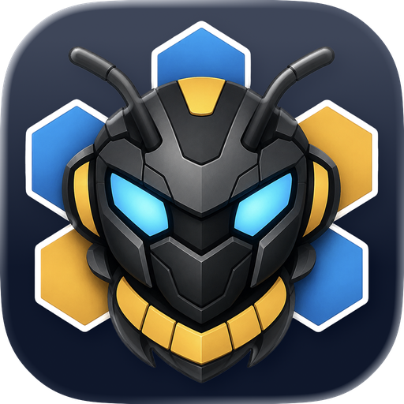

<div align="center">
  

  <p>
    <a href="https://github.com/LiamVisionary/hivemindos/stargazers"></a>
    <a href="https://github.com/LiamVisionary/hivemindos/network/members"></a>
    <a href="https://bankr.bot/launches/0xa382c83e2a3b79368f372c2eb9b6925ffaf45ba3"></a>
  </p>
  <p><b>HIVE Token:</b> 0xa382c83e2a3b79368f372c2eb9b6925ffaf45ba3</p>
</div>

> **A virtual private network for your agents.**
>
> HivemindOS lets agents collaborate across all of your machines through one private control room. Connect agents over trusted machine links, give them a shared Obsidian brain, move env and handoff files with Hivemind Sync, assign work, monitor progress, and manage the whole fleet from one simple dashboard.
>
> It supports modern agent runtimes like Hermes, OpenClaw, OpenCode, Codex, Claude Code, and Aeon, includes full MiroShark simulation integration, and can provision agent wallets on Base and Solana so agents can hold funds, pay for tools, and operate with their own controlled budgets.

Agents do not get credit just for saying done. HivemindOS evaluates managed work, verifies the evidence that matters, and uses a separate reviewer for consequential results. If the system cannot observe the work, it says so instead of inventing a pass.

Clone it, run one setup command, and get a local-first dashboard for the agents already living on your laptop, desktop, VPS, or spare machines. No public ports required.


## Screenshots

| Fleet | Work Automations |
|---|---|
|  |  |

| Brain Graph | Simulation |
|---|---|
|  |  |

## What It Does

- **See every agent from one dashboard** across this machine and trusted Tailscale-connected machines.
- **Cross-machine agent discovery and connection via Tailscale VPN** so agents can collaborate without public exposure.
- **Share one Obsidian brain** for memory, handoffs, skills, work boards, and shared context.
- **Open native Obsidian memory views** with seeded Bases and Canvas files over Agent Memory, projects, secure references, and recall topology.
- **Move shared env between agent machines** with Hivemind Sync helpers, without copying secrets by hand.
- **Send handoff files to a machine, runtime, or agent** with `hive-transfer` envelopes in the shared vault.
- **Assign work to agents** through a shared Kanban board with retries, stale-work recovery, and human handoff.
- **Evaluate completed agent work** across chat, the Work Board, companies, schedules, and managed runtime tasks, with trusted evidence and separate reviewers for consequential results.
- **Attach signed code provenance** with GitLawb Code Proof for project-linked work.
- **Create and import schedules** so supported runtimes can keep working in the background.
- **Run MiroShark simulations** from the same control room.
- **Give agents controlled Base and Solana wallets** so they can pay for approved tools, APIs, transactions, and actions.
- **Record reviewed ecosystem contribution as Honey** without treating it as cash, a revenue claim, or an automatic path to HIVE.

## Quick Start

By default, setup uses **Hivemind Link**: an app-managed Tailscale node that uses your own Tailscale account without requiring the system Tailscale VPN client.

- For local-only use, you can skip Tailscale completely.
- For app-managed Fleet/chat access, run normal setup. Hivemind Link keeps the collector bound to localhost and exposes it only through the embedded Link sidecar.
- For full Tailnet extras such as Tailscale SSH pulls, rsync repair, and HivemindOS-managed Syncthing peer addressing, run `./setup.sh --system-tailscale`, then install/sign in to system Tailscale.
- On macOS, the App Store/sandboxed GUI build can join your Tailnet, but it cannot host the Tailscale SSH server. That is fine for VPN, collector env pushes, and Syncthing, but `hive-env-add --pull-from` and rsync repair from that Mac need a Tailscale SSH-capable host. Tailscale documents the macOS build differences here: [Three ways to run Tailscale on macOS](https://tailscale.com/docs/concepts/macos-variants).
- To make a macOS machine host Tailscale SSH, install the open-source `tailscale` + `tailscaled` CLI/daemon build from the [Tailscaled on macOS guide](https://github.com/tailscale/tailscale/wiki/Tailscaled-on-macOS), or use Homebrew:

```bash
brew install --formula tailscale
sudo brew services start tailscale
sudo tailscale up
sudo tailscale set --ssh
```

If setup detects the sandboxed macOS GUI build while running interactively, it can offer to run the Homebrew formula flow for you.

- On Linux machines that should host Tailscale SSH:

```bash
curl -fsSL https://tailscale.com/install.sh | sh
sudo tailscale up
sudo tailscale set --ssh
```

Then run HivemindOS setup:

```bash
git clone https://github.com/LiamVisionary/hivemindos.git
cd hivemindos
./setup.sh
```

On native Windows PowerShell, run:

```powershell
git clone https://github.com/LiamVisionary/hivemindos.git
cd hivemindos
powershell -ExecutionPolicy Bypass -File .\setup.ps1
```

Then open the dashboard printed by setup, usually:

```txt
http://localhost:5020
```

The dashboard is protected by a local device unlock token because its API can read env values, manage runtime config, and perform wallet actions. Setup stores the token in `.env.local` as `HIVEMINDOS_DASHBOARD_DEVICE_TOKEN`, offers to copy it to your clipboard, and prints the recovery commands:

```bash
dashboard-auth copy-token
dashboard-auth reset-token
dashboard-auth rotate-secret
```

Use `copy-token` when you need to paste the token into the unlock screen again. Use `reset-token` if the token is lost, then restart the dashboard so it reloads `.env.local`. Use `rotate-secret` when you also want to invalidate existing browser sessions after restart. If the installed `dashboard-auth` helper is not on PATH yet, run the same commands from the cloned repo as `pnpm dashboard-auth <command>`.

In the macOS desktop app, enrolled Touch ID is detected automatically and can unlock the dashboard without a separate passkey registration step. In a browser, unlock once with the token, open **Security** in the dashboard navigation, and choose **Add this device**. Supported devices can then use Face ID, Touch ID, Windows Hello, or another built-in user-verifying passkey. The token remains visible as the optional recovery or preference fallback. Browser passkeys require HTTPS or a localhost dashboard URL and are registered for the exact dashboard hostname, so a different hostname may need its own enrollment.

Setup checks Node.js and pnpm/Corepack, installs dependencies, installs the hive env helpers and dashboard auth recovery command, installs the lightweight machine monitor where supported, prepares GitLawb Code Proof where available, starts the dashboard when possible, and can open the dashboard for you. Production dashboard builds are skipped by default; use `./setup.sh --build` when you explicitly want one. On macOS/Linux use `setup.sh`; on native Windows use `setup.ps1`.

GitLawb setup is proof-ready by default, not full node hosting by default. On macOS/Linux, interactive setup offers to install `gl`, `git-remote-gitlawb`, and the `gitlawb-node` binary, then offers to create a local DID without registering with a public node. HivemindOS does not start a GitLawb node, install Docker/Postgres, expose repo hosting, or enable federation/IPFS/Arweave/staking during first setup. Full local node setup stays lazy and is surfaced from Integrations or project linking when a project needs local GitLawb repo hosting.

To remove HivemindOS later, run the matching uninstaller. It asks one prompt at a time before removing services, generated files, GitLawb Code Proof cache/managed binaries, hive env helpers, shared-skill agent hints, or optional apps such as Tailscale, Syncthing, pnpm, GnuPG, and Obsidian:

```bash
./uninstall.sh
```

```powershell
powershell -ExecutionPolicy Bypass -File .\uninstall.ps1
```

## The First 10 Minutes

1. Run `./setup.sh`.
2. Open the dashboard.
3. Check **Fleet** for local and Tailscale-connected machines.
4. Open **Work** to create a task and assign it to your agents.
5. Open **Brain** to connect the shared Obsidian workspace.
6. Open **Scheduler** to import or create background jobs.
7. Add shared env vars when your agents need keys:

```bash
hive-env-add OPENAI_API_KEY
hive-env-add ANTHROPIC_API_KEY=...
hive-env-remove OLD_API_KEY
```

## Honey, HIVE, Cloud Credits, And Compute

HivemindOS keeps three concepts separate:

1. Honey is an optional, non-transferable record of reviewed ecosystem contribution.
2. Hivemind Cloud credits are purchased, spend-only service value for managed agents and hosted compute.
3. HIVE is an optional external token used for community identity and explicitly supported payment paths.

Honey is not cash, company ownership, a claim on revenue, or automatically convertible to HIVE. Official Honey-to-HIVE exchange and claim routes fail closed unless HivemindOS separately enables an authorized hosted conversion policy. Buying Cloud credits never mints Honey or HIVE, and neither local UI state nor a client request can create official spendable value.

Privacy stays local-first. Honey contribution tracking is disabled by default; you enable it from the Wallets view. When enabled, HivemindOS sends usage metadata such as workspace id, agent id, token count, model label, timestamp, source, and event id. Prompts, responses, files, wallet keys, and machine details are not sent to the Honey ledger.

Hermes CLI sessions are measured from Hermes' own persisted token counters when the dashboard is running. OpenClaw exposes token usage through its `/usage`, `/status`, CLI, and transcript usage surfaces; HivemindOS only records OpenClaw usage once it can read real usage fields, not from text-length guesses. A self-hosted ledger is operator-controlled and is not an official HivemindOS balance or entitlement source.

For server-verified usage records, use the hosted compute gateway. Keep using Hermes, OpenClaw, or another OpenAI-compatible client directly, but set its provider endpoint to the HivemindOS gateway:

```txt
OPENAI_BASE_URL=https://hivemindos-compute-gateway.hivemindos.workers.dev/v1
OPENAI_API_KEY=hive-v1.<workspace-id>.<bankr-llm-key>
```

Your workspace id is stored at `~/.hivemindos/install-id` after setup. The gateway forwards the request through Bankr, reads the provider-returned token usage, and signs the usage receipt server-side without requiring the dashboard chat surface.

### Local OpenAI-Compatible Runtimes

HivemindOS can register the `hivemind-os` managed runtime for local model servers that expose OpenAI-style endpoints. LM Studio works with the default base URL:

```txt
LOCAL_OPENAI_BASE_URL=http://127.0.0.1:1234
LOCAL_OPENAI_API_KEY=
LOCAL_OPENAI_MODEL=<loaded-model-id>
```

The adapter calls `POST /v1/chat/completions` for chat and `GET /v1/models` for model discovery. Point the same runtime at Ollama, vLLM, llama.cpp server, LocalAI, or another compatible service by changing the base URL and model.

### Model Providers

Runtimes are the agent shells that run work. Model providers are the inference backends those shells can use.

- **Bankr LLM** is a model provider gateway for HIVE-funded compute. HivemindOS can use it from OpenAI-compatible profiles directly, and can select it as a provider for runtime-native model selectors such as Hermes and OpenClaw.
- **UsePod** is a model provider for marketplace inference. HivemindOS keeps UsePod setup in provider settings so funded tokens, spend caps, and routing stay provider-specific instead of becoming a separate runtime.
- **OpenRouter and runtime-native providers** remain selectable where the underlying runtime exposes them.

Provider credentials belong in shared env keys such as `BANKR_LLM_KEY`, `BANKR_API_KEY`, `BANKR_KEY`, `USEPOD_TOKEN`, or the runtime's own configured key name. Use `hive-env-check KEY` to verify presence without printing secret values.

## Features

| Feature | What it does |
|---|---|
| **Fleet dashboard** | Tracks machines, agents, runtimes, health, tasks, logs, and capabilities in one place |
| **Zero Human Companies** | Runs company cockpits through a HivemindOS crew by default or an optional saved AEON workspace and skill, with explicit goals, governance, stop controls, and run history |
| **Founder Mode** | Turns one outcome into a reviewable company blueprint with crew, capabilities, compute, budgets, approvals, a first Lab, and proof requirements |
| **Hivemind Labs** | Runs bounded, evidence-backed company experiments and graduates reviewable methods through preview-first, explicitly confirmed Hive Skill Fusion |
| **Outcome proof packs** | Shows deliverables, eval receipts, provenance, signed work receipts, and explicit verification gaps for consequential work |
| **[Agent evaluations](docs/for-users/features/agent-evaluations.md)** | Checks whether managed work deserves credit, verifies authoritative evidence, and records accepted, rejected, needs evidence, error, or unobserved outcomes |
| **Tailscale agent network** | Connects agents across your machines through your private Tailscale VPN |
| **Machine monitor** | Lightweight local service that reports agent status and runtime health to the dashboard |
| **Runtime adapters** | Supports Hermes, OpenClaw, OpenCode, Codex, Claude Code, Aeon, MiroShark, and generic machine-backed agents through a neutral adapter layer |
| **Local model runtimes** | Adds a generic OpenAI-compatible adapter for LM Studio, Ollama, vLLM, llama.cpp server, LocalAI, and similar `/v1/chat/completions` services |
| **Model providers** | Lets model-selectable runtimes choose providers such as Bankr LLM, UsePod, OpenRouter, and runtime-native provider configs |
| **Shared Obsidian brain** | Stores memory, handoffs, shared context, Kanban state, and reusable skills in a local markdown vault |
| **Obsidian-native brain views** | Seeds `.base` and `.canvas` files plus shared skills for Obsidian Markdown, Bases, Canvas, and clean web markdown extraction |
| **Packaged Hive skills** | Ships auto-installed Hive skills such as `hive-assimilate` and `hive-pulse` plus optional third-party skill packs through the shared brain skill shelf |
| **Token and cost savings** | Uses shared-brain recall, capability search, assimilation, Karpathy-guided edits, Hive Fusion, provider routing, and usage analytics to reduce repeated token spend |
| **Hivemind Sync** | Moves shared brain files, shared env, and handoff transfers between trusted machines |
| **Handoff transfers** | Routes artifacts through `.hivemindos-transfers/` to a specific machine, runtime, or agent with payload hashes and acknowledgements |
| **Work board** | Gives agents a shared Kanban queue for tasks, delegation, retries, stale work, and human handoff |
| **GitLawb Code Proof** | Links projects and tasks to signed GitLawb provenance while keeping local node hosting optional |
| **Scheduler studio** | Creates, imports, pauses, resumes, and runs background schedules where runtimes support them |
| **Agent chat bridge** | Sends chat to supported runtimes through a local safety and redaction proxy |
| **MiroShark integration** | Runs and tracks MiroShark simulations from the HivemindOS dashboard |
| **Agent wallets** | Provisions controlled Base and Solana wallets for agents that need budgets or payment rails |
| **Honey contribution records** | Lets opt-in users record reviewed ecosystem contribution while keeping Honey separate from purchased Cloud credits and optional HIVE payment paths |
| **Alerts** | Surfaces auth failures, stuck work, runtime issues, and handoff problems in one inbox |
| **Skill shelf** | Shares skills across Codex, Claude, Hermes, Gemini, OpenClaw, and Aeon |
| **Local-first storage** | Keeps runtime profiles, vault paths, and local URLs on your machine |

## Runtime Support

| Runtime | Current support |
|---|---|
| **Hermes** | Local HTTP/runtime adapter, session visibility from `~/.hermes`, chat bridge, tasks, logs, and process snapshots |
| **OpenClaw** | Gateway adapter with WebSocket chat and model selection through the generic runtime bridge |
| **OpenCode** | CLI runtime profile with installed-status and provider/model selection; dashboard chat bridge is not enabled yet |
| **Codex** | CLI runtime profile with authentication readiness, managed background tasks, run logs, model selection, and completion evaluation. Dashboard chat bridge is not enabled yet. |
| **Claude Code** | CLI runtime profile with authentication readiness, managed background tasks, run logs, model selection, and completion evaluation. Dashboard chat bridge is not enabled yet. |
| **Aeon** | Optional AEON v0.1 control plane for CLI-backed skills, packs, MCP, Strategy/Soul, gateways, chains/reactive work, self-healing health, OKF knowledge, provenance, outputs, notifications, and Zero Human Company execution |
| **MiroShark** | Companion integration for simulation workflows and dashboard visibility |
| **Generic machines** | Read-only machine snapshots through the local monitor |

No single runtime is required. HivemindOS works with one local agent, a mixed fleet, or future adapters.

## How Sharing Works


HivemindOS uses Tailscale in a few specific ways:

- **Agent connection:** the dashboard finds and connects to agent machines through your Tailscale VPN.
- **Hivemind Link:** optional app-managed Link nodes use Tailscale's embedded `tsnet` library to expose only the local HivemindOS collector over your own Tailscale account, without requiring the system Tailscale VPN client.
- **Hivemind Sync env:** `hive-env-add` and `hive-env-remove` send env changes to trusted ready peers through collector `/env` endpoints. `--pull-from` still uses Tailscale SSH because it asks a peer to export its local env set.
- **Hivemind Sync brain:** the shared Obsidian vault is a local folder. In Brain, choose whether an external provider such as Obsidian Sync, iCloud Drive, Dropbox, Git, or another folder sync tool owns realtime sync, or let HivemindOS pair Syncthing over Tailscale.
- **Hivemind Sync handoffs:** `hive-transfer` writes routed file envelopes into `.hivemindos-transfers/` inside the vault. Syncthing or the selected vault sync owner moves those files to the receiver.
- **Vault repair:** rsync over Tailscale SSH is available as an advanced fallback for one-shot push, pull, or bidirectional repair jobs. rsync repair conflicts are written as explicit `.conflict-host-timestamp` copies; Syncthing conflicts are handled by Syncthing in the vault and Syncthing UI.

Plaintext secrets do not belong in the shared vault. If GPG is configured, `hive-env-add` can refresh an encrypted `hive.env.gpg` backup in your chosen notes folder. Wallet secrets for user wallets and agent wallets stay in the local encrypted wallet vault, and the Wallets view can sync a restorable GPG backup as `hive.wallet-vault.gpg` with a metadata-only `hive.wallet-vault.md` reference note.

## Shared Env

For the focused docs page, see [Shared Env](docs/for-users/whole-brain/shared-env.md).

Setup installs `hive-env-add`, `hive-env-remove`, `hive-env-delete`, `hive-env-check`, and `hive-env-run` into `~/.local/bin`. GnuPG is optional; when it is installed and a recipient or public key is configured, `hive-env-add` refreshes the encrypted `hive.env.gpg` backup in the shared notes folder.

```bash
hive-env-add KEY=value
hive-env-add KEY
hive-env-remove KEY
hive-env-delete KEY
hive-env-add --import-env
hive-env-add --reconcile
hive-env-add --pull-from root@ubuntu.tailnet.ts.net
hive-env-check KEY
hive-env-run -- command arg...
```

By default `hive-env-add` updates the canonical shared hive env at `~/.hivemindos/.env`. `hive-env-remove KEY` removes a key from that same store and syncs the removal through the same path. `hive-env-delete KEY` is an alias for people who reach for delete first. Apps, scripts, and agents should consume that shared env at runtime instead of copying secrets into project `.env` files or runtime-specific secret stores. Use `hive-env-check KEY` to verify presence without printing values, and use `hive-env-run -- <command>` to execute any command with the shared env loaded into the child process.

Runtime-specific compatibility writes remain explicit for legacy/runtime-native stores:

```bash
hive-env-add --runtime hermes ANTHROPIC_API_KEY
hive-env-add --runtime aeon OPENAI_API_KEY
hive-env-add --runtime openclaw TAVILY_API_KEY
```

When Hivemind Sync is enabled, HivemindOS updates trusted peer machines that report they are ready for env sync. Setup offers to pull missing keys from an existing ready peer and push this machine's keys to peers. `--reconcile` does the same push later through collector `/env` endpoints, which is useful after adding a new device. `--pull-from USER@HOST` imports missing keys from a trusted peer over Tailscale SSH and preserves local conflicts by default; use `--conflict remote-wins` or `--conflict fail` when you need a stricter merge. Advanced users can set `HIVE_ENV_TAILNET_TARGETS` to choose exact target machines.

## Shared Obsidian Brain

The Brain workspace can hold:

- agent inboxes
- shared context
- handoff notes
- AI ready note templates and vault writing conventions
- Hivemind Sync handoff transfer envelopes in `.hivemindos-transfers/`
- typed shared memories under `Memory/Distillations/Agent Memory/`
- a private local memory index under `Operations/Brain Services/Agent Memory Index.jsonl`
- a local entity/alias index under `Operations/Brain Services/Agent Memory Entity Index.jsonl`
- soft retrieval telemetry under `Operations/Brain Services/Agent Memory Retrievals.jsonl`
- optional hash-only GitLawb memory receipts under `Operations/Brain Services/Agent Memory Proofs.jsonl`
- optional derived Neo4j service status under `Operations/Brain Services/Neo4j.md`
- Kanban board state
- reusable skills
- runtime instructions

Shared Brain Memory gives agents a local-first remember/recall/answer layer through `/api/brain/memory` and the installed `hive-brain` CLI. Raw or non-managed agents can run `hive-brain answer "<query>"`; the CLI discovers the running local API when available and falls back to local vault/index search when it is not. Setup also installs `hive-brain-hook` and registers it as a Claude Code `UserPromptSubmit` hook, so raw Claude prompts can receive relevant shared-brain context even when they are not routed through the HivemindOS app. Default recall is tiered: it checks typed Agent Memory first, returns that distilled layer when the hit is strong, and otherwise augments with relevant markdown from the full shared vault through the generated lexical index at `Operations/Brain Services/Full Vault Search Index.jsonl`. Markdown remains authoritative; cross-process writes use staged recovery, and typed/full-vault indexes publish checksummed checkpoints, compressed artifacts, and content-addressed deltas while preserving complete legacy JSONL mirrors. Agent Memory retains at most 256 generated generations with a checkpoint every 32; full-vault search retains 32 with a checkpoint every 4. `hive-brain generations` and health report the exact retained replay horizon after pruning. Durable records use canonical `memoryKey` heads and content hashes so current recall returns one active truth per key without exact duplicate bodies, while `hive-brain evolve` preserves prior versions as Markdown history. `hive-brain replay` and `compare` inspect retained historical recall, and deliberately scoped brain capsules provide optional encrypted portability with read-only search and Brain Review-gated imports. Routine run receipts and retries use a separate bounded local operational journal instead of crowding durable recall. Review-gated pattern mining can propose recurring learnings, reusable skills, and stable jobs, but it never applies them automatically. `--scope agent-memory` narrows recall to the typed/proven memory write layer, while `--scope full-vault` forces broad vault recall, including `Operations/Secure` reference/status notes for credential names and set/missing status without storing plaintext secret values.

Benchmark snapshot: a 1,000-query live memory matrix reached `0.90/0.98/0.94` Top-1/Top-3/MRR; exact current-title recall was `1.00`, unsupported questions abstained `10/10`, operational routing passed `40/40`, and temporal Top-1 reached `0.96`. An authenticated 400-request API run measured `6.75ms` p50 and `12.12ms` p95. A 1,500-memory synthetic scale fixture held Top-1 at `1.00` with `27.16ms` p50, and an eight-case live full-vault test measured a `15.39x` direct-index speedup with the same expected Top-1 in every case. Across 2,036 evidence-labeled LoCoMo and LongMemEval questions, HivemindOS retrieved the source session in the Top-50 `99.80%` of the time. Complete GPT-5.4 Mini OAuth answer-and-judge runs at Top-50 scored `76.62%` on LoCoMo, `53.40%` on LongMemEval, `41.12%` on BEAM 1M, and `37.04%` on BEAM 10M; these are not direct comparisons with differently configured published runs. The 47-event pattern fixture reached precision/recall `1.00/1.00`; autonomous production promotion remains disabled pending real-world review data. See [Shared Brain Memory Benchmarks](docs/for-users/features/shared-brain-benchmarks.md) for the complete scorecard and limitations.

Neo4j is optional and derived: `/api/brain/neo4j/*` can connect to an existing graph through env keys, sync HivemindOS-derived nodes with `MERGE`, and run read-only Cypher queries. The Obsidian vault remains canonical, and plaintext Neo4j credentials stay out of notes and dashboard state.

The shared brain can also export Agent Memory and conversation mirrors as an Open Knowledge Format v0.1 bundle through `/api/brain/okf`. The generated bundle defaults to `Operations/Brain Services/OKF Export/` and contains plain markdown concept files with YAML frontmatter, `index.md`, `log.md`, and validation results. The native Obsidian vault remains the source of truth; OKF is the portable exchange format for outside agents, catalogs, and graph tools.

Compiled Knowledge gives agents a second retrieval lane for reviewed source material and durable synthesis. `/api/brain/knowledge` and the `hivemind-mcp` tools can compile findings into `Synthesis/Compiled Knowledge/<domain>/`, then search entity/concept/summary pages, fetch exact nodes, follow backlinks, inspect graph shape, and scan wiki health. In the deterministic 720-page compiled-wiki benchmark, HivemindOS measured `67.18ms` median compiled search, `39.45ms` graph overview, `31.71ms` node lookup, and `32.44ms` backlink lookup while keeping the source files as normal Obsidian markdown.

Packaged skills ship from `packaged-skills/`. Setup auto-installs foundational Hive skills such as `hive-assimilate`, `hive-pulse`, `hive-capability-search`, and the Hive Fusion skills into the shared brain, along with curated third-party Obsidian Native Brain Pack skills. `hive-pulse` bundles a pinned MIT licensed last-30-days research engine and installs a `hive-pulse` command shim so agents can run social, market, GitHub, and web signal briefs without a separate upstream install. Setup also installs `hive-capability-search` for shell-based agents; app-routed, phone-hosted, or no-shell agents should use already-injected capability-search context, an authenticated `/api/context-index` bridge, or exposed MCP/context-index tools instead. Optional packaged skills stay in `packaged-skills/optional/` until the user installs them. See [Packaged Skills](docs/for-users/packaged-skills/index.md), [Token And Cost Savings](docs/for-users/features/token-and-cost-savings.md), and the [slash command reference](docs/for-users/slash-commands.md) for the agent-facing catalog surfaces.

HivemindOS can auto-detect common local Obsidian vault locations, validate an explicit vault path, and fall back to local Kanban storage at `~/.hivemindos/kanban` if the vault is unavailable.

Setup also seeds the first brain foundation: an AI ready vault contract under `Operations/`, reusable note templates under `Templates/HivemindOS/`, the default full-vault search index status note plus optional Obsidian CLI and plugin-pack status notes under `Operations/Brain Services/`, encrypted backup references under `Operations/Secure/`, runtime mirrors under `Operations/Runtime Mirrors/`, vault cleanup manifests under `Operations/Vault Migrations/`, and disabled workflow schedules for morning context, meetings, research ingestion, weekly review, vault health checks, decision review, project updates, argument building, book notes, feedback capture, and durable knowledge distillation.

For multi-machine sharing, Hivemind Sync can pair Syncthing over Tailscale so trusted machines each keep a local copy of the same vault. No Obsidian Sync subscription is required. If you already use Obsidian Sync, iCloud Drive, Dropbox, Git, or another provider, select that external sync owner in Brain so HivemindOS does not auto-pair Syncthing on top of it. When setup finds another Syncthing-capable collector and the Brain setting allows HivemindOS Syncthing, it can pair the shared vault and write/read a small test note to verify that sync is actually flowing.

For the full brain model, see [Whole Brain](docs/for-users/whole-brain/index.md). For the sync and networking model, see [Hivemind Sync](docs/for-users/features/hivemind-sync.md) and [Syncing And Tailscale Architecture](docs/for-users/syncing-and-tailscale.md). For artifact handoffs, see [Hivemind Sync Handoff Transfers](docs/for-users/targeted-file-transfers.md).

## Multi-Machine Setup

On each additional machine that runs agents:

```bash
git clone https://github.com/LiamVisionary/hivemindos.git
cd hivemindos
./setup.sh --collector-only
```

On Windows, use:

```powershell
git clone https://github.com/LiamVisionary/hivemindos.git
cd hivemindos
powershell -ExecutionPolicy Bypass -File .\setup.ps1 -CollectorOnly
```

Collector-only setup installs the lightweight machine monitor and chooses app-managed Hivemind Link by default. It starts the services needed for dashboard discovery without installing or running another dashboard on that machine.

The first run builds `hivemind-linkd`, starts a localhost-only collector, and prints a Tailscale authorization URL. Open that URL on the main HivemindOS hub—or any device signed into the same Tailscale account as the hub—approve the machine, and return to Fleet Hive. The new collector appears automatically after Link connects.

To choose a different network mode explicitly:

```bash
./setup.sh --system-tailscale
./setup.sh --local
```

Remote HivemindOS traffic in Link mode travels over Tailscale's encrypted device links, while the collector itself stays on `127.0.0.1`.

In Link mode, remote collectors are reached through the local sidecar URL shape
`http://127.0.0.1:8788/peer/<tailnet-host%3A8787>/...`. Keep that `/peer/...`
URL on port `8788`; only plain local collector URLs should use the active
collector port from `~/.hivemindos/collector.env`.

Use `./setup.sh --system-tailscale` only when you want the older full Tailnet setup surface: macOS firewall allow-listing, Tailscale SSH, rsync repair, and Hivemind Sync Syncthing pairing.

## Private By Default

- The machine monitor is read-only by default.
- The dashboard API requires a signed local session, a verified dashboard passkey, or the device token before non-public routes can read secrets, mutate config, or touch wallet actions. On macOS, the desktop shell offers a Touch ID-gated unlock path while preserving the token as an explicit preference and recovery fallback.
- Remote machines should stay private to Tailscale or Hivemind Link.
- In Hivemind Link mode, the collector binds to localhost and the `hivemind-linkd` sidecar is the only Tailnet-facing entry point.
- Chat requests pass through a local agent security proxy before reaching runtimes.
- Common secret formats are redacted before runtime output renders.
- Local skill actions use allowlisted folders and argument validation where the dashboard exposes direct skill execution.
- Agent profiles and local runtime URLs are not synced by the app.
- Broad API keys should not be placed into shared folders.

More detail: [Tailscale Fleet Telemetry](docs/for-users/architecture/tailscale-fleet-telemetry.md)

## Advanced Setup

```bash
./setup.sh --help
./setup.sh --non-interactive
./setup.sh --import-skills
./setup.sh --import-skills codex,hermes,aeon
./setup.sh --share-skills codex,openclaw
./setup.sh --no-shared-skills
./setup.sh --skip-deps
./setup.sh --build
./setup.sh --skip-collector
./setup.sh --skip-dashboard
./setup.sh --force
```

Automation can skip prompts with `CI=true`, `HIVE_SETUP_INTERACTIVE=false`, or explicit env choices:

```bash
HIVE_SHARED_SKILLS=true HIVE_SHARED_SKILL_IMPORTS=all HIVE_SHARED_SKILL_TARGETS=all ./setup.sh
HIVE_SHARED_SKILLS=false ./setup.sh
HIVE_GITLAWB_SETUP=true HIVE_GITLAWB_IDENTITY=true ./setup.sh
```

More detail: [docs/for-users/integrations/gitlawb.md](docs/for-users/integrations/gitlawb.md)

## Development

```bash
pnpm install
pnpm typecheck
pnpm lint
pnpm build
pnpm benchmark:context-savings
./scripts/hive-env-run -- pnpm benchmark:e2e-token-savings
pnpm start
```

The dashboard runs on port `5020` by default.

Before committing any feature or user-visible fix, add an entry to `CHANGELOG.md` with the timestamp, commit status, verification, and intended commit-message summary. See `AGENTS.md` for the project rule.

## Roadmap

See [ROADMAP.md](ROADMAP.md).

## License And Brand

HivemindOS source code and documentation are open source under the
[MIT License](LICENSE). You may use, modify, distribute, host, and sell the
MIT-licensed code, including commercially.

The HivemindOS name, logos, app icons, HIVE/Honey marks, official badges, domain
names, and official visual identity are reserved. Forks and commercial services
are welcome, but modified or hosted versions must not imply that they are the
official HivemindOS app, token, Honey ledger, compute gateway, marketplace, or
cloud service unless the project owner has authorized that use.

If you ship a modified build, rename it, replace the prominent HivemindOS brand
assets, and make the fork or service relationship clear. See
[TRADEMARK.md](TRADEMARK.md) for the brand policy.

## Attributions

HivemindOS packages agent-control patterns, runtime adapter code, HivemindOS workflow templates, MiroShark companion integration, and local-first fleet telemetry into a standalone open-source dashboard. The AI SDK route and chat UI patterns were adapted from public Next.js agent examples. Some workflow templates were inspired by `shannhk/hermes-agent-control-room`.

Thanks to [AgentRQ](https://github.com/agentrq/agentrq) for the Apache-2.0 task-orchestration ideas behind HivemindOS' MCP-native Work Board additions: claimable tasks, status updates, task comments, human approval requests, and event-driven agent coordination.

Thanks to [mr-gigabee/gigabee](https://github.com/mr-gigabee/gigabee) for the MIT-licensed decentralized inference-marketplace reference that informed Hive Compute's worker registration, queued job dispatch, token streaming, earnings-accounting shape, and local Ollama worker setup.
