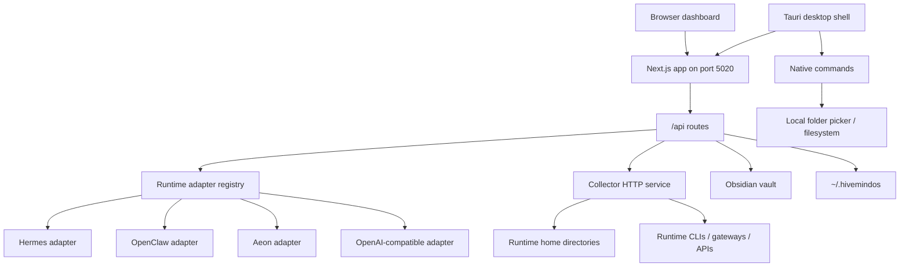
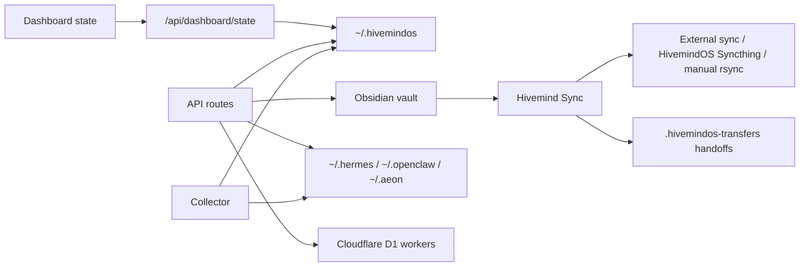

# Architecture

This is the map of how HivemindOS actually runs.

Use it when you need to know where a feature lives, how data moves, and which boundaries are sensitive. The app has a lot of surface area, but the shape is simple: local dashboard, local APIs, private collectors, shared vault, runtime adapters, and explicit rails for anything risky.

## System Goals

HivemindOS is built around five constraints:

- Local-first operation: the dashboard, collector, runtime homes, and vault are local files and local services by default.
- Private fleet networking: cross-machine discovery and control happen through Tailscale or the app-managed Hivemind Link sidecar, not public ports.
- Runtime neutrality: Hermes, OpenClaw, Aeon, and OpenAI-compatible local servers are exposed through a common adapter surface where possible.
- Shared brain persistence: durable collaborative state lives in an Obsidian vault when available, with narrow local fallbacks for app continuity.
- Explicit safety surfaces: env sync, wallet actions, remote update, file access, and paid/API actions are routed through explicit APIs and UI controls.

<figure class="imagePlate">
  
<figcaption>The boundaries are intentionally uneven. Public docs are public. Browser and API surfaces are local. Vault and wallet material stay private. Tailnet and Workers are explicit external edges.</figcaption>
</figure>

## Main Components

| Layer | Primary files | Responsibility |
|---|---|---|
| Dashboard shell | `src/app/page.tsx`, `src/features/dashboard/DashboardApp.tsx` | Server-side view selection, client dashboard state, polling, navigation, and feature orchestration |
| Dashboard views | `src/features/dashboard/views/**`, `src/components/**` | Fleet, My Apps, Work/Kanban, Scheduler, Swarm, Brain/Vault, Chat, Wallet, Phone, AEON, More, Notifications, Memory, Files, Env |
| API facade | `src/app/api/**/route.ts` | Local HTTP boundary for dashboard actions, runtime calls, fleet polling, app discovery, vault access, wallets, Honey, phone calls, MiroShark, and maintenance |
| Runtime adapters | `src/lib/services/runtime-adapters/**` | Common runtime interface for status, skills, schedules, runs, outputs, sessions, env sync, integrations, and model selection |
| Local services | `src/lib/services/**` | File-backed state, Obsidian services, telemetry, wallets, brain services, runtime utilities, integrations |
| Native bridge | `src/lib/native/**`, `src-tauri/src/lib.rs` | Tauri-only desktop status, local directory listing/creation/display, and native folder picker fallbacks |
| Collector | `scripts/agent-telemetry-collector.mjs` | Small Node HTTP service on each machine for health, snapshots, runtime chat/session bridges, Hivemind Sync env movement, skills, directories, Syncthing, transfers, and E2E hooks |
| Setup scripts | `setup.sh`, `setup.ps1`, `uninstall.sh`, `uninstall.ps1`, `scripts/install-telemetry-collector.sh` | Installation, collector/Link service registration, helper CLI installation, uninstall mirror |
| Workers | `workers/honey-ledger`, `workers/compute-gateway` | Optional Cloudflare D1-backed Honey ledger and trusted OpenAI-compatible compute gateway |

## Runtime Process Model



The dashboard talks to local App Router APIs. Those APIs either touch local files, call the runtime adapter registry, or proxy to a local or remote collector. The collector stays small on purpose. It reads runtime state, exposes selected actions, and reports capabilities.

## Dashboard Architecture

The dashboard route is `src/app/page.tsx`. It accepts `view` and `vaultPanel` query parameters and renders `DashboardApp` with any server-prefetched work history needed for the History view.

`DashboardApp` is the main client orchestrator. It owns persisted local UI state, fleet polling, runtime availability, env state, wallets, chat state, scheduler state, MiroShark and Swarm state, brain services, AEON state, app status, and feature wiring. Most of the real behavior is pushed into focused hooks and view components:

- `src/features/dashboard/hooks/use-dashboard-polling-effects.tsx`: repeated polling for fleet, Kanban, and MiroShark state.
- `src/features/dashboard/hooks/use-kanban-task-controller.tsx`: board CRUD, task state changes, review/undo, and git status checks.
- `src/features/dashboard/hooks/use-kanban-dispatch-controller.tsx`: agent dispatch, runtime session polling, completion handling, and stalled work detection.
- `src/features/dashboard/hooks/use-scheduler-controller.tsx`: shared schedules and runtime schedule actions.
- `src/features/dashboard/hooks/use-agent-controller.tsx`: runtime integrations, agent creation, runtime sessions, and agent settings.
- `src/features/dashboard/hooks/use-miroshark-brain-controller.tsx`: MiroShark, Obsidian graph, shared skills, recent directories, GBrain/Syntho-adjacent vault context, and shared notifications.
- `src/features/dashboard/hooks/use-wallet-files-controller.tsx`: wallets, Honey, runtime usage, MoneyClaw, x402, maintenance, and runtime files.
- `src/features/dashboard/hooks/use-status-chat-input-controller.tsx`: chat sending, setup/status helpers, Obsidian access, and sync actions.
- `src/features/dashboard/hooks/use-chat-tree-controller.tsx`: chat folder tree, runtime session hydration, directory context, and folder creation.
- `src/features/dashboard/hooks/use-fleet-notifications-controller.tsx`: app version refresh, machine setup/init, notification storage, note intake, and fleet update coordination.

The active top-level navigation exposes Fleet, Work, Brain, Chat, Wallet, and More. Work owns Kanban, Scheduler, Swarm, and History. More links to Integrations, My Apps, Phone, AEON, maintenance, memory telemetry, runtime files, notifications, env, and related utility views.

## API Facade

The app uses Next.js route handlers under `src/app/api`. That is the dashboard's local trust boundary. Major route families are:

- `/api/fleet/*`: machine discovery, snapshots, updates, provisioning helpers.
- `/api/fleet/apps` and `/api/fleet/app-icon`: hivenet app/service discovery, icon proxying, health checks, and API route catalogs.
- `/api/gitlawb/*` and `/api/projects/*`: GitLawb Code Proof status/setup plus Hivemind project registry and repo linking.
- `/api/runtimes/*`: runtime status, integrations, skills, schedules, runs, outputs, env sync, sessions, availability.
- `/api/chat/*`: runtime chat bridge, session reads, and chat folders.
- `/api/kanban`: file-backed board CRUD, task moves, claims, completions, comments, events.
- `/api/obsidian/*`: vault status, open/access notes, sync, graph, skills, wallets, machine aliases, recent directories.
- `/api/scheduler/*`: shared schedule import, runtime actions, skill actions, folder browsing.
- `/api/phone`: phone gateway pairing/status, scheduled phone rings, and dashboard agent-call starts.
- OpenClaw runtime support is kept inside the generic runtime and chat layers rather than standalone product routes.
- `/api/miroshark/*`: companion status, install/start, swarm templates/runs, analysis.
- `/api/wallet/*`: local wallet creation, balances, sends, MoneyClaw, backups, x402 calls.
- `/api/brain/*`: GBrain, Syntho, and trading-brain status/install/query actions.
- `/api/env`, `/api/runtime-files`, `/api/maintenance`, `/api/memory-telemetry`, `/api/telemetry/events`, `/api/work-history`: local utility surfaces.

See [API And Storage Reference](api-and-storage.md) for route grouping details.

## Runtime Adapter Layer

Runtime adapters are registered in `src/lib/services/runtime-adapters/registry.ts`. The shared adapter type lives in `src/lib/services/runtime-adapters/types.ts`.

Known runtimes:

| Runtime | Kind | Current capabilities |
|---|---|---|
| OpenClaw | Gateway | status, chat, model selection |
| Hermes | Interactive | status, chat, runs, memory, session search, background tasks, X search, video generation, Codex runtime, Kanban decomposition, setup, wallet tools, model selection |
| Aeon | Background | status, skills, schedules, runs, outputs, memory, background tasks, notifications, setup |
| HivemindOS | Interactive | status, chat, model selection |

Adapters let the dashboard ask a runtime for status, skills, schedules, runs, outputs, env sync, sessions, and model options without baking every runtime path into the UI. OpenClaw stays on the generic Hivemind runtime bridge here.

## Native Desktop Bridge

The browser and desktop app share the same Next.js UI. The Tauri shell adds a narrow native command surface. It does not fork the product:

- `desktop_status`: returns build commit, branch, dirty flag, runtime phase, native host, and native server port.
- `list_local_directories`: lists local directories for This Mac without routing through the collector.
- `create_local_folder`: creates a local child folder after cleaning the requested name.
- `display_local_path`: normalizes expanded home paths for display.

Frontend adapters live in `src/lib/native/desktop-status.ts` and `src/lib/native/filesystem.ts`. Browser users keep using the existing API routes. Desktop users can call native commands first, then fall back to the API path when the target is remote or native access is unavailable.

## Collector Architecture

`scripts/agent-telemetry-collector.mjs` is the machine-local collector. It defaults to `AGENT_TELEMETRY_PORT=8787` and `AGENT_TELEMETRY_HOST=0.0.0.0`. In Link mode, the collector binds privately and Hivemind Link exposes it through the sidecar.

Collector responsibilities include:

- `/health`: host, app version, env sync readiness, and capability advertisement.
- `/snapshot`: local runtime/machine snapshot data used by Fleet.
- `/agents`: local runtime agent inventory and creation/deletion.
- `/env`: read, import, or remove shared and runtime-specific env through the hive env helpers and Hivemind Sync.
- `/directories`: safe directory browsing for target selection.
- `/apps` and `/app-proxy/<port>`: local app/service discovery and proxying for hivenet launchers.
- `/skills` and `/skills/auto-sync`: skill inventory and provider auto-sync.
- `/runtime-*` surfaces: runtime integrations, sessions, chat bridge, schedules, runs, outputs, env sync.
- `/syncthing/*`: Syncthing status/pairing support for shared vault sync.
- `/e2e/*`: real-fleet E2E hooks for env, skills, and encrypted file sharing.
- `/update`: start a checkout update on a remote HivemindOS machine.

The collector is private infrastructure. Keep it on the Tailnet or Hivemind Link path. Do not expose it publicly by default.

## State And Storage



Important storage locations:

- `~/.hivemindos`: install id, server-backed dashboard state, shared env, collector env, Kanban fallback, runtime agent registry, wallet vault, Honey ledger cache, runtime run cache, skill auto-sync config.
- Obsidian vault: shared brain, Kanban board files, notifications, scheduled-run files, wallet ledger notes, recent directories, shared skills, machine aliases, graph access logs, GBrain and Syntho service notes.
- Runtime homes: Hermes, OpenClaw, Aeon, and local OpenAI-compatible server config/state.
- Cloudflare D1: optional official Honey ledger and compute gateway accounting.

## Shared Brain Model

The shared brain is a normal markdown folder, usually `~/Documents/Obsidian/hivemindos-vault`. The app can detect common vault paths or use `NEXT_PUBLIC_OBSIDIAN_VAULT_PATH`.

The vault is not the transport. Sync is owned by exactly one selected owner:

- External provider: Obsidian Sync, iCloud Drive, Dropbox, Git, or user-managed Syncthing.
- HivemindOS Syncthing: dashboard pairs collectors and lets Syncthing replicate over Tailnet.
- Manual repair: dashboard runs one-shot rsync repair over Tailscale SSH.

See [Syncing And Tailscale Architecture](syncing-and-tailscale.md).

For the full user-facing brain architecture, folder map, service split, shared-skill model, vault health flow, and docs/setup sync rule, see [Whole Brain](../whole-brain/).

## Fleet Networking

Fleet discovery combines local state, Tailscale device data, Link metadata, and collector health checks. Hivemind Link is the default app-managed networking path. It uses the user's own Tailscale account through an embedded `tsnet` sidecar while keeping the collector bound to localhost.

Security posture:

- Keep collectors private to Tailscale or Link.
- Prefer read-only inspection by default.
- Remote update and Hivemind Sync env movement are explicit actions.
- Secret values move through helper commands and request bodies, not shared notes.
- Vault sync repair is explicit and writes conflict copies rather than silently overwriting.

## Wallet, Honey, And Compute

Local wallet state is managed through `src/lib/services/wallet/**`. Agent wallet secrets stay in a local encrypted vault under `~/.hivemindos`. Optional backup records can be written into the shared vault when configured.

Honey has two paths:

- Local observation: the dashboard reads supported runtime usage and submits capped metadata.
- Trusted reward compute: `workers/compute-gateway` provides an OpenAI-compatible endpoint that forwards through Bankr/OpenRouter-compatible routing, reads provider usage, signs receipts, and submits them to `workers/honey-ledger`.

The official Honey ledger stores privacy-safe metadata only. It should not receive prompts, responses, local paths, machine names, Tailnet IPs, or wallet secrets.

## Build And Verification

Common checks:

```bash
pnpm lint
pnpm typecheck
pnpm build
```

Focused checks used during development:

```bash
pnpm test:kanban
pnpm test:dashboard-nav
pnpm test:fleet-local
pnpm test:gbrain-foundation
pnpm test:aeon-brain
pnpm test:honey-economics
node scripts/check-file-sizes.mjs
```

Real fleet E2E suites require suitable Tailnet machines and runtime setup:

```bash
pnpm test:e2e:real-fleet
pnpm test:e2e:agents
pnpm test:e2e:env
pnpm test:e2e:skills
pnpm test:e2e:file-share
pnpm test:e2e:kanban
pnpm test:e2e:dashboard-smoke
```
