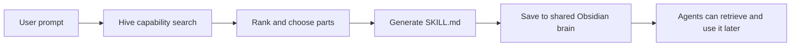

# Hive Fusion

Hive Fusion is the part of HivemindOS that turns a messy, normal human request into a reusable skill.

Not a plan. Not a fake checklist. A real `SKILL.md` saved into the shared Obsidian brain, built from the parts the hive can actually use right now.

The point is simple: the user should not have to know which machine has ComfyUI, which runtime can search X, which agent has the right writing voice, which tool sends Telegram messages, or which endpoint creates Kanban tasks. The agent should search the hive, choose the right pieces, and package the workflow so it can be reused.

That is the whole thing.

## What It Solves

Without Fusion, multi step agent work gets brittle fast.

You end up with prompts that secretly depend on a provider name, a private machine, a local endpoint, a CLI command, or one agent remembering some random setup detail from three days ago. That works until it does not.

Fusion makes that knowledge discoverable instead:

- Skills live in the shared brain.
- Tools and schemas come from runtime inventories.
- Apps come from fleet and Tailnet discovery.
- API routes come from the dashboard context index.
- Machine placement comes from fresh capability records.
- Optional brain services like GBrain can add semantic retrieval when they are installed.

So a prompt like this:

> Turn the latest Base news into an X post with a matching image, and send it to my Telegram.

Can become a durable skill that knows it needs research, writing voice, image generation, and delivery, without hard-coding the current provider or Tailnet endpoint.

## The Mental Model

Fusion is basically capability search plus skill authoring.

The agent starts with the user prompt, then asks, “What can the hive already do that fits this?”

It searches across:

- Shared brain skills
- Runtime tool schemas
- Connected apps
- App endpoint catalogs
- Dashboard API routes
- Runtime capability records
- Workspace and docs context

Then it ranks the candidates, selects the strongest parts, and writes a skill that explains how to run the task again.



## What Gets Created

A Fusion run writes a shared brain skill under:

```text
Skills/<generated-slug>/SKILL.md
```

The generated skill includes:

- The original trigger prompt
- A short description
- The selected fused capabilities
- The wider candidates that were considered
- A workflow for re-running capability search before execution
- Safety rules for side effects, secrets, and private endpoints

The important part is that the generated skill is not supposed to freeze the world in place. It should remember the shape of the workflow, then re-run discovery when it is actually used.

That keeps the skill durable even if ComfyUI moves to another machine, Telegram delivery gets replaced, or a better specialist agent is installed later.

## Capability Search

Capability search is the reusable core.

Fusion calls `/api/context-index` with the prompt and a handful of inferred search queries. For example, if the prompt mentions Telegram, Kanban, Obsidian notes, image generation, or X posts, Fusion adds targeted search queries for those intent slots.

This matters because generic similarity search is not enough. A prompt can say “send me a summary,” and the system needs to understand that delivery is not optional. If the prompt says “create Kanban tasks,” then Kanban has to survive ranking. It cannot get crowded out by five vaguely relevant brain skills.

The current Fusion service explicitly boosts common intent slots:

- Kanban, tasks, priority, brief, work board
- Telegram, message, delivery, notification
- Brain, vault, Obsidian, notes, RAG, memory
- X, Twitter, tweet, social post
- Image, visual, render, generation, ComfyUI, Z-Image

That is not meant to be the final list forever. It is the start of a capability matrix that should grow as the hive learns more kinds of work.

## Connected Apps

Connected apps are discovered through the existing app and fleet logic.

Fusion should not hard-code ComfyUI, Z-Image, MiroShark, or any other app endpoint. It should retrieve connected app records, app endpoint catalogs, aliases, machine labels, and route metadata from the same surfaces the dashboard already uses.

That gives us the behavior we actually want:

- Searching “image generation” can surface ComfyUI or Z-Image if they are available.
- Searching “simulation” can surface MiroShark if it is configured.
- Searching “send message” can surface the configured delivery path.
- Searching “brain notes” can surface Obsidian and shared skills.

The app name is an implementation detail unless the user specifically cares. The capability is what matters.

## The Three Fusion Skills

HivemindOS has three related Fusion skills:

### Hive Skill Fusion

Creates a reusable skill from a prompt.

Use this when the user is asking for a repeatable capability, like “make a skill that finds Base news, writes an X post, generates an image, and sends it to Telegram.”

### Hive Workflow Fusion

Creates a workflow from several steps that need to run together.

Use this when the output is more like an execution path than a reusable single skill. The workflow can still reference shared skills, agents, apps, and tools, but the emphasis is orchestration.

### Hive AEON Fusion

Turns a skill or workflow into something AEON can run in the background.

Use this when the user wants a fused capability to become scheduled, recurring, on duty, or autonomous.

## Why This Needs The Shared Brain

Fusion gets much more useful when the shared Obsidian brain is treated as the durable memory layer.

The generated skill should land in the shared brain so every agent can retrieve it later. The skill should also reference the shared brain when it needs voice, style, project notes, task history, or old decisions.

That means the app can start small:

1. Use lightweight context index retrieval.
2. Pull only the records needed for the task.
3. Create the fused skill.
4. Save it to the shared brain.

And then grow into deeper retrieval:

1. Sync connected app snapshots into the brain.
2. Import the vault into GBrain when installed.
3. Run semantic search when the user enables it.
4. Keep generated skills as normal markdown, not trapped in app state.

That is the right posture. Cheap index first. Deep retrieval only when it helps.

## Safety Rules

Fusion should be powerful, but not reckless.

The generated skill should:

- Re-run capability search before execution.
- Avoid raw Tailnet IPs and local absolute paths in durable skill text.
- Use connected app discovery and dashboard proxy surfaces instead of hard-coded endpoints.
- Ask before side effects when multiple targets are possible.
- Never expose secrets, private chat IDs, wallet keys, or machine-specific private data.
- Return proof after doing work, such as a saved file, message receipt, endpoint response, task ID, or clear failure reason.

This is especially important because Fusion is meant to combine things. Combining tools is where agents can become genuinely useful, but it is also where bad assumptions get expensive.

## Current Code Paths

Primary service:

- `src/lib/services/fusion/fusion-skill.ts`

API route:

- `src/app/api/fusion/skill/route.ts`

Dashboard view:

- `src/features/dashboard/views/FusionPanel.tsx`
- `src/features/dashboard/views/fusion-showcase/FusionShowcase.tsx`

Shared skill writer:

- `src/lib/services/obsidian/brain-skills.ts`

Capability retrieval:

- `src/lib/services/context-index.ts`
- `src/app/api/context-index/route.ts`

## What Good Looks Like

A good Fusion run does not just produce a pretty card.

It should prove:

- It discovered the right kinds of capabilities.
- It selected the parts the task actually requires.
- It saved a shared brain skill with a useful name.
- It avoided hard-coded private endpoints.
- It can be retrieved and used later by another agent.
- If the task says “send it,” “create it,” or “post it,” the execution path has a real delivery surface, not just a plan.

That is the standard.

Fusion is not meant to make agents look busy. It is meant to make the hive remember how to do useful work.
