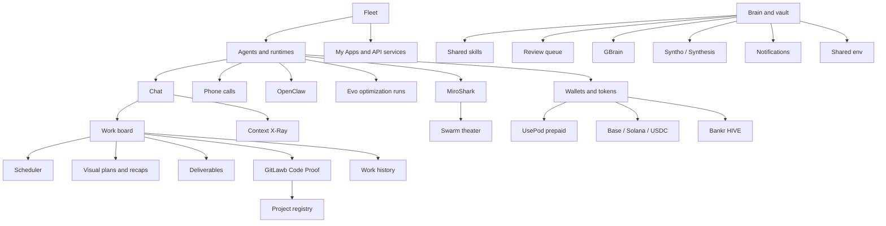

# Feature Guide

HivemindOS is a control room for local agent fleets.

The feature surface follows the work an operator actually does: connect machines, configure agents, run work, preserve memory, manage money rails, and keep the local system healthy.

<section class="atlasHero">
  <strong>Use this page as the operator map.</strong>
  
Each section below explains what the feature area is responsible for, which docs go deeper, and how the pieces connect in the running app. For the full visual pass, use the <a href="../diagrams.html">Diagrams And Maps</a> atlas.

</section>

  <section class="signalCard"><strong>Connect</strong>Fleet, collectors, Tailnet/Link, apps, and runtime discovery.</section>
  <section class="signalCard"><strong>Operate</strong>Agents, chat, Work board, Code Proof, Scheduler, Swarm, and deliverables.</section>
  <section class="signalCard"><strong>Remember</strong>Obsidian vault, shared skills, QMD, Neo4j, GBrain, Syntho, Synthesis, and notifications.</section>
  <section class="signalCard"><strong>Pay</strong>Wallets, crypto rail routing, Base/Solana, USDC, UsePod prepaid, Honey, HIVE, and x402.</section>
  <section class="signalCard"><strong>Integrate</strong>GitLawb, MiroShark, Nango, GitHub OAuth, My Apps, phone, and work history.</section>
  <section class="signalCard"><strong>Maintain</strong>Hivemind Sync, runtime files, native helpers, memory telemetry, and repair checks.</section>

## Control Room

The product starts with machines and agents. Fleet tells you what is online, which collectors are reachable, what runtimes and apps are available, and whether a machine is drifting from the expected setup. Agents and Chat turn those runtimes into configured workers with models, env, wallets, vault context, file attachments, and session history.

  <section class="docCard">
    <h3>Fleet</h3>
    
Machine discovery, local and remote collectors, version drift, setup actions, active app badges, and hivenet API route catalogs.

    <a href="fleet.html">Open Fleet</a>
  </section>
  <section class="docCard">
    <h3>Agents, Runtimes, And Chat</h3>
    
Runtime profiles, model selection, adaptive free-model routing, adapter behavior, streaming chat, `/swarm [number]` agent-team passes, `/swarm-goal` build orchestration, attachments, directory context, and phone-call handoff.

    <a href="runtimes-and-chat.html">Open agents</a>
  </section>
  <section class="docCard">
    <h3>Calling</h3>
    
Dashboard and mobile agent calls, BYOK Realtime by default, speaker-only fallback, phone pairing, and paid LiveKit/SFU cloud rooms.

    <a href="calling.html">Open calling docs</a>
  </section>

## Looped Work

Looped work is where operator intent turns into agent execution. A loop contract can start from chat, Scheduler, Queen Bee, Evo, a company launch, or the Work Board. The board remains one access path: it captures rough ideas, promotes ready tasks, tracks claimed work, stores comments and run records, and turns finished output into deliverables. Zero Human Companies add a company cockpit around the same generic loop layer: charters, crews, budgets, approvals, apex goals, and private learning loops. Scheduler adds repeated background work. Chat can launch `/swarm [number]` agent-team passes for parallel role-specific analysis, or `/swarm-goal <build request>` to rewrite a loose build request and hand it to Queen Bee for parallel agent execution. Swarm and MiroShark handle rehearsal, `/swarm-sim` simulations, and heavier analysis workflows.

  <section class="docCard">
    <h3>Zero Human Companies</h3>
    
Agent-run company cockpits with charters, crews, apex goals, approvals, budgets, kill switches, Work Board dispatch, and capability-capital learning summaries.

    <a href="zero-human-companies.html">Open company docs</a>
  </section>
  <section class="docCard">
    <h3>Work Board And Scheduler</h3>
    
Kanban tasks as one loop access path, generic loop contracts, templates, eval gates, project provenance, Code Proof badges, agent dispatch, deliverables, schedules, machine-aware folder picking, background jobs, and work history.

    <a href="work-and-scheduler.html">Open work docs</a>
  </section>
  <section class="docCard">
    <h3>MiroShark And Runtime Gateways</h3>
    
Simulation templates, `/swarm-sim` chat launches, swarm rehearsal, run intelligence, route catalogs, and the minimal runtime-gateway integration points HivemindOS owns.

    <a href="miroshark-and-openclaw.html">Open gateway docs</a>
  </section>
  <section class="docCard">
    <h3>Evo Optimization Runs</h3>
    
Benchmark-driven optimization loops as a managed runtime: gated experiment trees in git worktrees, Hermes-hosted orchestration, experiment status and dashboard discovery, and fleet machines as remote SSH backends.

    <a href="evo-optimization.html">Open Evo docs</a>
  </section>

## Code Proof

Agent work gets messy fast if the only record is a chat transcript or a commit message. HivemindOS keeps the private trail: which task was opened, which project it belonged to, which machine handled it, and which agent touched it. GitLawb adds the part that code needs, signed provenance.

The goal is not to make every user manage a code node on day one. The normal path is quieter than that. HivemindOS can be Code Proof ready during setup, tasks can attach to projects, and linked projects can carry GitLawb proof metadata. If a project later needs local repo hosting, the deeper GitLawb node path is there.

That gives the Work board a better answer than “an agent changed something.” It can point to the project, the task, the machine, and the proof trail behind the code.

  <section class="docCard">
    <h3>GitLawb Integration</h3>
    
The full integration guide for CLI setup, local DID identity, project links, proof badges, Fleet Code Node status, and lazy node hosting.

    <a href="../integrations/gitlawb.html">Open GitLawb docs</a>
  </section>
  <section class="docCard">
    <h3>Work Board Details</h3>
    
How project IDs and sanitized proof records move through tasks without leaking private vault paths, secrets, or machine details.

    <a href="work-and-scheduler.html">Open Work docs</a>
  </section>

## Shared Brain

The shared brain is a normal Obsidian vault, not a proprietary database. HivemindOS writes durable state into that vault when available: Kanban records, notifications, scheduled runs, wallet records, shared skills, service notes, and reviewed outputs. Agent Memory now supports entity-linked recall, temporal history, action memories, and soft retrieval telemetry. QMD, GBrain, Neo4j, Syntho, and Trading Brain stay optional service layers around the vault.

  <section class="docCard">
    <h3>Brain, Vault, And Skills</h3>
    
Obsidian vault routing, entity-linked memory, temporal recall, compiled wiki search, graph access, shared skills, QMD, Neo4j, GBrain, Syntho, Trading Brain, Synthesis, OKF export, and sync ownership.

    <a href="brain-vault-and-skills.html">Open brain docs</a>
  </section>
  <section class="docCard">
    <h3>Agent-Native Workflows</h3>
    
Action metadata, dashboard pins, Shared Brain review proposals, Context X-Ray manifests, and visual plan/recap artifacts.

    <a href="agent-native-workflows.html">Open workflow docs</a>
  </section>
  <section class="docCard">
    <h3>Hive Fusion</h3>
    
Capability search plus skill authoring: turn a normal prompt into a reusable shared-brain skill built from the agents, apps, tools, and workflows the hive already has.

    <a href="hive-fusion.html">Open fusion docs</a>
  </section>
  <section class="docCard">
    <h3>Packaged Skills</h3>
    
HivemindOS-owned Hive skills, third-party packaged skills, auto-install policy, optional catalog rules, and skill maintenance contracts.

    <a href="../packaged-skills/">Open packaged skills</a>
  </section>
  <section class="docCard">
    <h3>Whole Brain</h3>
    
The separated GitHub Pages guide for vault structure, compiled knowledge, brain services, OKF exchange bundles, shared skills, sync health, and architecture sync rules.

    <a href="../whole-brain/">Open whole brain</a>
  </section>
  <section class="docCard">
    <h3>Hivemind Sync</h3>
    
The cross-machine route for shared brain files, shared env keys, and vault-backed handoff transfers.

    <a href="hivemind-sync.html">Open sync docs</a>
  </section>
  <section class="docCard">
    <h3>Env, Files, Notifications, And Maintenance</h3>
    
Shared env, runtime file browsing, notification storage, process telemetry, and conservative repair checks.

    <a href="env-files-notifications-maintenance.html">Open system docs</a>
  </section>
  <section class="docCard">
    <h3>Token And Cost Savings</h3>
    
How shared brain recall, Hive skills, assimilation, fusion workflows, model routing, and usage analytics reduce repeated token spend.

    <a href="token-and-cost-savings.html">Open savings docs</a>
  </section>

## Economy And Integrations

Wallet and token features are explicit rails, not a background permission pool. Agent wallets handle controlled Base and Solana balances plus x402 paid requests. The crypto capability router lets agents ask for intents such as paid API, private transfer, or Bankr trading, then select or prepare the configured rail without executing spending itself. UsePod is prepaid runtime access. Honey and Bankr HIVE are reward and claim paths. Integrations connect the control room to outside systems without making those systems own local state.

  <section class="docCard">
    <h3>Wallets, Tokens, Honey, HIVE, And x402</h3>
    
Agent wallets, crypto rail routing, USDC sends, MoneyClaw, UsePod deposits, wallet-vault backups, Honey rewards, Bankr HIVE claims, paid requests, and stock buying via Alpaca or on-chain xStocks.

    <a href="wallets-honey-and-x402.html">Open wallet docs</a>
  </section>
  <section class="docCard">
    <h3>Monetization</h3>
    
The free-vs-paid product boundary, including HivemindOS Cloud Agent Calls as a premium managed LiveKit feature.

    <a href="../monetization/">Open monetization</a>
  </section>
  <section class="docCard">
    <h3>Integrations And Work History</h3>
    
GitLawb Code Proof, Nango, GitHub OAuth fallback, My Apps, API-service launchers, phone pairing, dynamic changelog, and work history.

    <a href="integrations-and-work-history.html">Open integrations</a>
  </section>
  <section class="docCard">
    <h3>Agent Provider Integrations</h3>
    
External agent providers, MCP catalog discovery, Browser Use, OpenHands, Aider, n8n, Agentic Inbox, and Queen Bee PRD decomposition.

    <a href="agent-provider-integrations.html">Open provider docs</a>
  </section>

## Native And Background Surfaces

The browser and native app share the same Next.js UI. Tauri adds local filesystem and status helpers on This Mac, while AEON and Hermes keep their runtime-specific setup and background work docs separate.

  <section class="docCard">
    <h3>Native App</h3>
    
Tauri development shell, packaged Next server, native status bridge, and desktop filesystem helpers.

    <a href="../native-app.html">Open native docs</a>
  </section>
  <section class="docCard">
    <h3>AEON Brain Access</h3>
    
GitHub Actions tailnet brain access with visibility-scoped policy and OIDC-gated brain endpoint calls.

    <a href="../runtimes/aeon/github-actions-brain-access.html">Open AEON docs</a>
  </section>
  <section class="docCard">
    <h3>Hermes Local Setup</h3>
    
Local Hermes runtime setup notes for running interactive agent work beside the HivemindOS dashboard.

    <a href="../runtimes/hermes/local-setup.html">Open Hermes docs</a>
  </section>

## Feature Map

