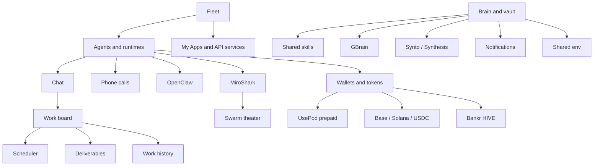

# Feature Guide

HivemindOS has a lot of surface area, so features are split into focused pages instead of one long reference file. Each page explains what the feature does, how it works internally, and what capabilities it exposes.

For a faster spatial read, start with the [Diagrams And Maps](../diagrams.md) atlas.

## Core Control Room

- [Fleet](fleet.md): machine discovery, health, collector snapshots, updates, provisioning helpers, app discovery, and hivenet API route catalogs.
- [Agents, Runtimes, And Chat](runtimes-and-chat.md): runtime profiles, adapters, model selection, streaming chat, sessions, attachments, directory context, and phone-call handoff.
- [Work Board And Scheduler](work-and-scheduler.md): Kanban tasks, agent dispatch, deliverables, schedules, native folder picking, and background jobs.

## Shared Brain

- [Brain, Vault, And Skills](brain-vault-and-skills.md): Obsidian vault, brain graph, shared skills, GBrain, Synto, trading brain, note intake, Synthesis, and sync ownership.
- [Env, Files, Notifications, And Maintenance](env-files-notifications-maintenance.md): env sync, runtime files, notifications, memory telemetry, and repair checks.

## Integrations And Economy

- [MiroShark And Runtime Gateways](miroshark-and-openclaw.md): simulation, swarm rehearsal, run intelligence, route catalogs, and the minimal runtime-gateway integration points HivemindOS keeps.
- [Wallets, Tokens, Honey, HIVE, And x402](wallets-honey-and-x402.md): agent wallets, Base/Solana token rails, MoneyClaw, UsePod prepaid deposits, encrypted wallet vault backup, Honey rewards, compute gateway, Bankr HIVE claims, and paid requests.
- [Integrations And Work History](integrations-and-work-history.md): Nango, GitHub OAuth fallback, My Apps, API-service launchers, phone pairing, dynamic changelog, and work history.

## Native And Background Surfaces

- [Native App](../native-app.md): Tauri development shell, packaged Next server, native status bridge, and desktop filesystem helpers.
- [AEON Brain Access](../runtimes/aeon/github-actions-brain-access.md): GitHub Actions tailnet brain access with visibility-scoped policy.
- [Hermes Local Setup](../runtimes/hermes/local-setup.md): local Hermes runtime setup notes.

## Feature Map

