# Diagrams And Maps

<section class="atlasHero">
  <strong>A visual atlas for the local agent control room.</strong>
  
These plates and diagrams are quick maps for the hive: what talks to what, where state lives, which rails move money or tokens, and where the trust boundaries sit.

</section>

## Generated Infographic Plates

<figure class="imagePlate imagePlateHero">
  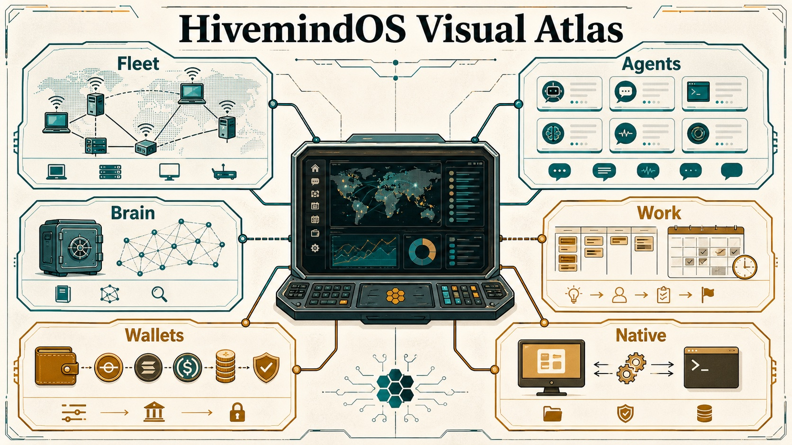
  <figcaption>Generated overview plate for the full HivemindOS visual atlas.</figcaption>
</figure>

  <figure class="imagePlate">
    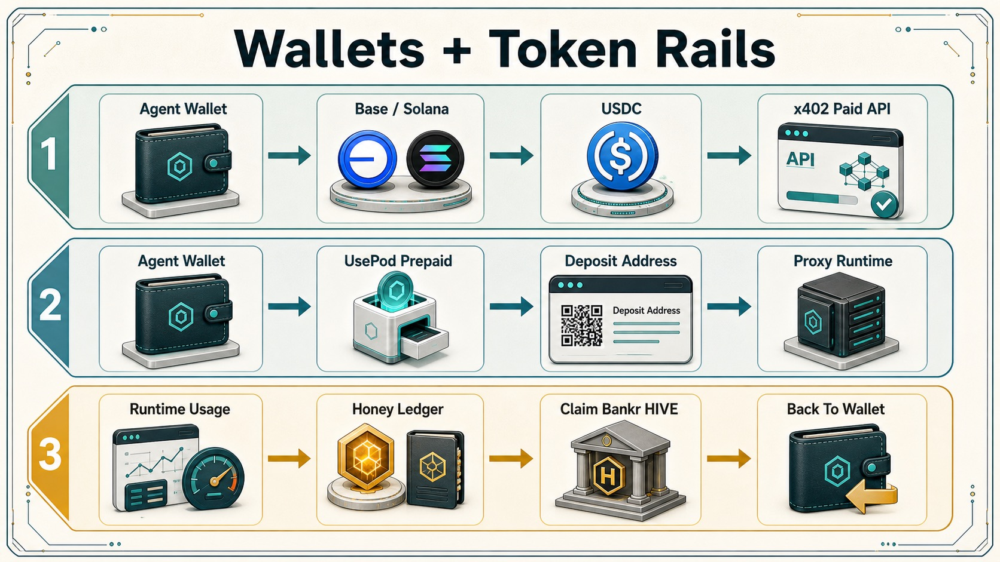
    <figcaption>Wallet rails are three separate paths: wallet to x402, wallet to UsePod prepaid runtime, and runtime usage to Honey to Bankr HIVE claim.</figcaption>
  </figure>
  <figure class="imagePlate">
    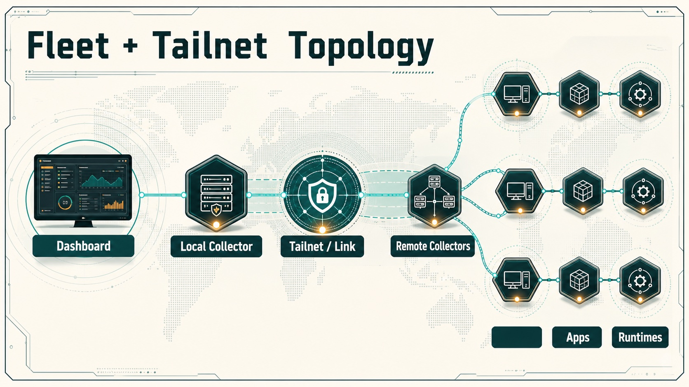
    <figcaption>Dashboard to local collector, then private Tailnet reachability out to remote collectors, machine health, apps, and runtimes.</figcaption>
  </figure>
  <figure class="imagePlate">
    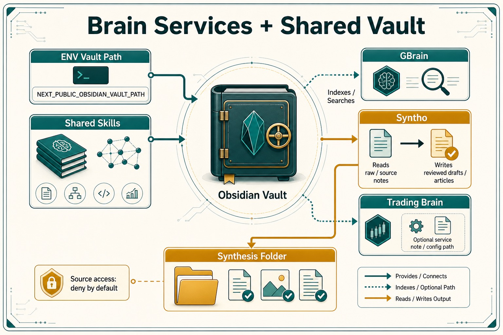
    <figcaption>ENV vault path into Obsidian, shared skills, GBrain retrieval, Syntho reviewed output, Trading Brain, and the Synthesis folder.</figcaption>
  </figure>
  <figure class="imagePlate">
    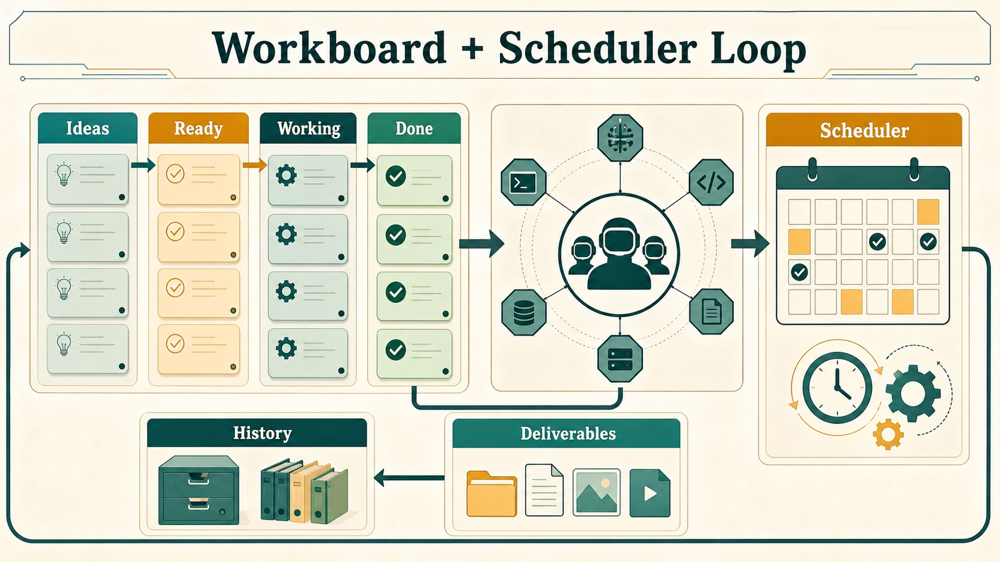
    <figcaption>Workboard lanes, scheduler loop, deliverables, and history.</figcaption>
  </figure>
  <figure class="imagePlate">
    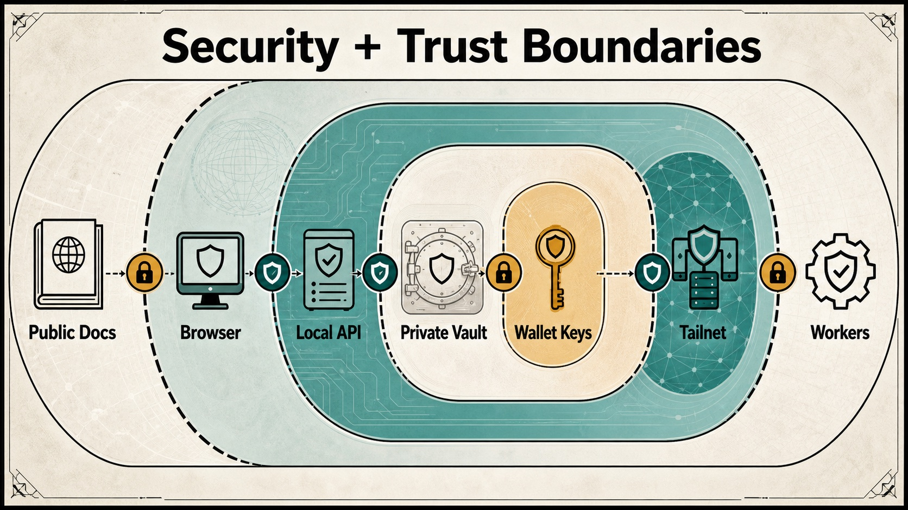
    <figcaption>Security boundaries across public docs, local APIs, wallet keys, Tailnet, and workers.</figcaption>
  </figure>
  <figure class="imagePlate">
    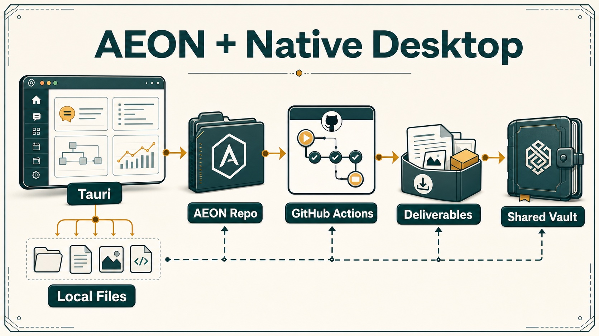
    <figcaption>AEON, Tauri native bridge, local files, GitHub Actions, deliverables, and shared vault.</figcaption>
  </figure>

## Rendered System Maps

  <a href="#control-room-map">Control Room Map Dashboard, APIs, collectors, runtimes, vault, workers.</a>
  <a href="#fleet-topology">Fleet Topology Local collector, remote collectors, Tailnet, app proxying.</a>
  <a href="#runtime-chat-path">Runtime Chat Path Agent profile to adapter to stream/session storage.</a>
  <a href="#wallet-token-rails">Wallet Token Rails Base, Solana, USDC, MoneyClaw, UsePod, x402.</a>
  <a href="#honey-hive-flow">Honey And HIVE Flow Observed usage, Honey ledger, Bankr claim path.</a>
  <a href="#workboard-lifecycle">Workboard Lifecycle Ideas, assignment, runs, deliverables, history.</a>
  <a href="#scheduler-loop">Scheduler Loop Shared schedules, runtime actions, skills, run phases.</a>
  <a href="#brain-services">Brain Services Obsidian, skills, GBrain, Syntho, trading brain.</a>
  <a href="#native-bridge">Native Bridge Tauri-first local actions with browser fallbacks.</a>
  <a href="#phone-voice">Phone And Voice Gateway, pairing, ring-agent, dashboard calls.</a>
  <a href="#aeon-github">AEON GitHub Path OAuth, repo setup, Actions, OIDC brain access.</a>
  <a href="#security-boundaries">Security Boundaries Local-only, Tailnet-only, public Pages, wallet keys.</a>

## Operator Signals

  <section class="signalCard"><strong>Primary State</strong>Shared Obsidian vault, `~/.hivemindos`, runtime homes, and browser preferences.</section>
  <section class="signalCard"><strong>Private Network</strong>Collectors, Link proxy, app proxies, Syncthing, and Tailnet services stay private.</section>
  <section class="signalCard"><strong>Money Surface</strong>Agent wallets, UsePod deposits, Honey/HIVE accounting, x402, and Bankr claims are explicit rails.</section>

## Control Room Map

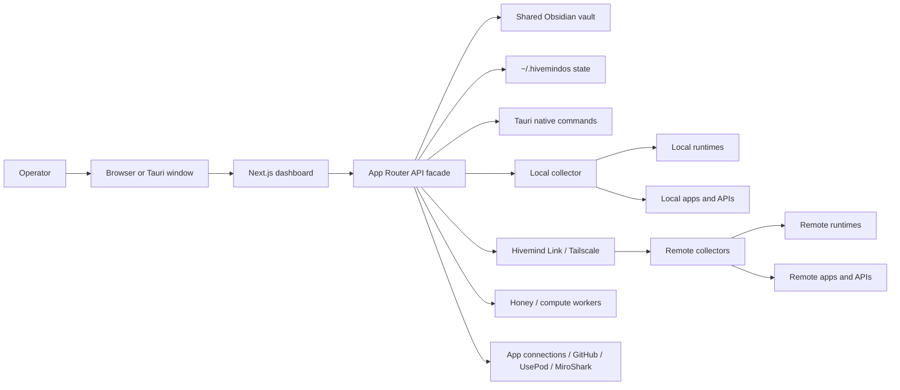

## Product Surface Infographic

  <section class="infoTile"><b>01</b><strong>Fleet</strong>Discovers machines, collectors, app badges, health, and hivenet services.</section>
  <section class="infoTile"><b>02</b><strong>Agents</strong>Profiles bind runtime, model, env, wallet, vault, machine, and call context.</section>
  <section class="infoTile"><b>03</b><strong>Work</strong>Kanban, scheduler, swarm, history, note intake, and deliverables.</section>
  <section class="infoTile"><b>04</b><strong>Brain</strong>Obsidian memory, graph, shared skills, GBrain, Syntho, trading brain.</section>
  <section class="infoTile"><b>05</b><strong>Wallets</strong>Base/Robinhood/Solana, USDC/USDG, UsePod deposits, MoneyClaw, Honey, HIVE, x402.</section>
  <section class="infoTile"><b>06</b><strong>Native</strong>Tauri status, local folder actions, deliverable opening, packaged server.</section>

## Fleet Topology

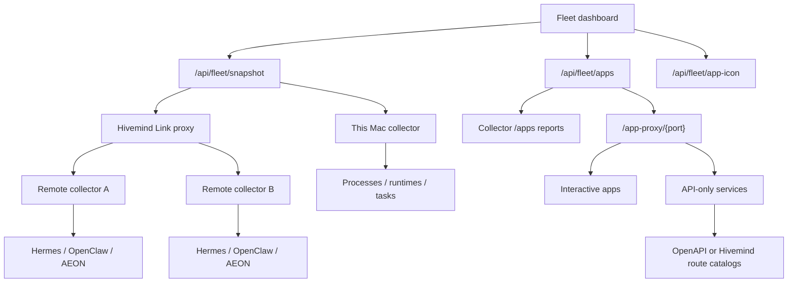

## Runtime Chat Path

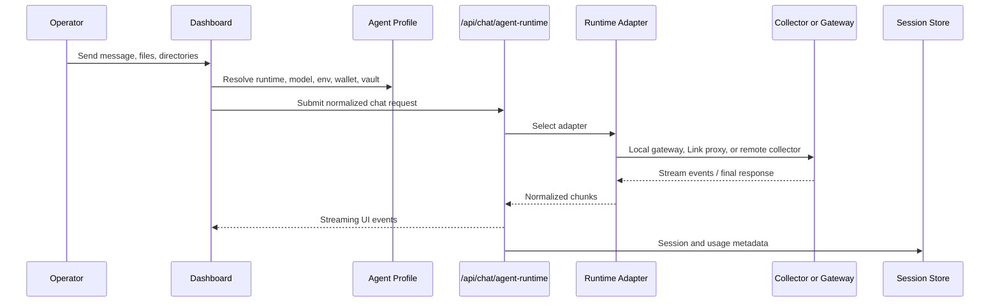

## Wallet Token Rails

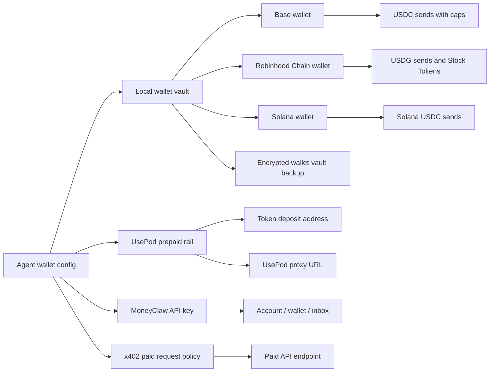

## Honey HIVE Flow

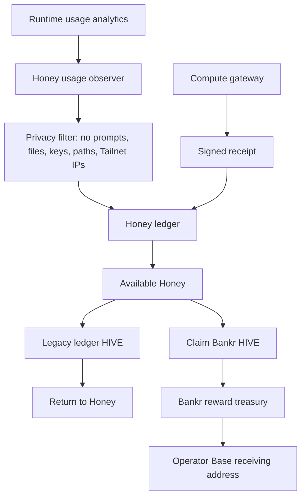

## Workboard Lifecycle

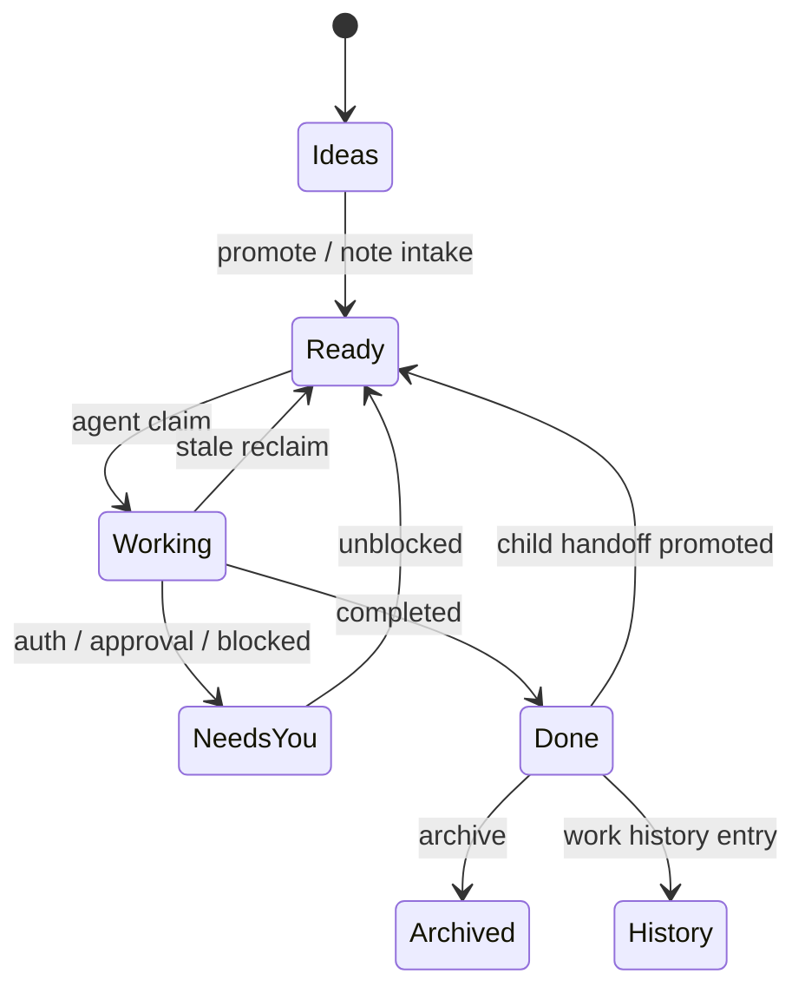

## Scheduler Loop

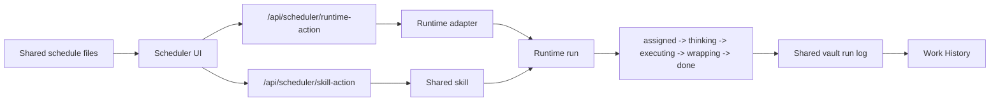

## Brain Services

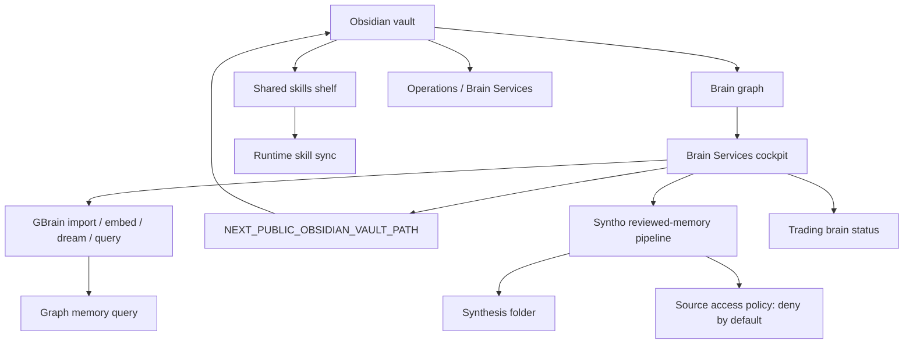

## Native Bridge

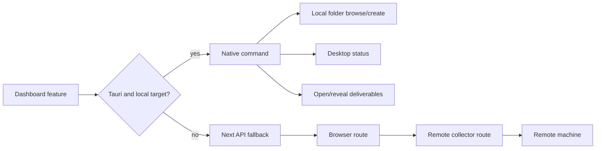

## Phone Voice

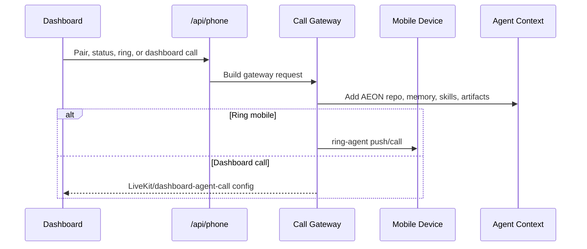

## AEON GitHub

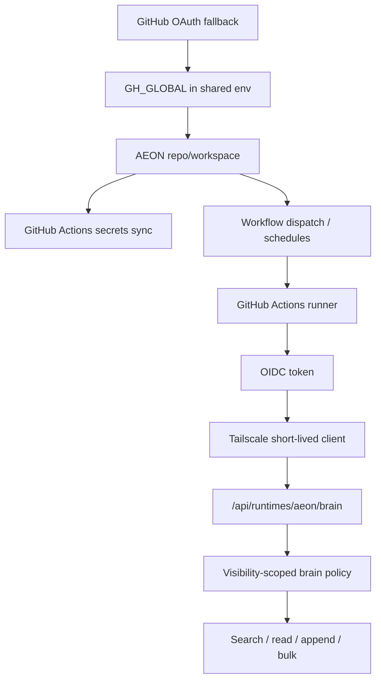

## MiroShark And Swarm

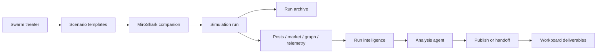

## Storage Map

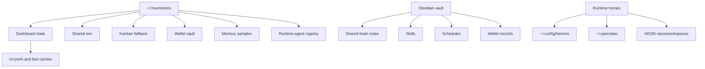

## API Surface Map

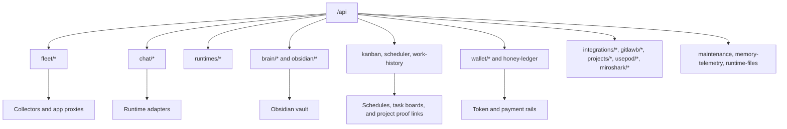

## Security Boundaries

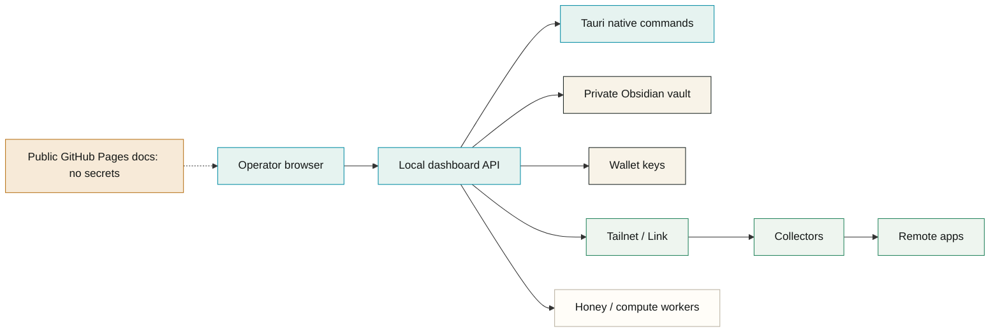

## Visual Reading Order

  <section class="infoTile"><b>A</b><strong>Start with topology</strong>Use Control Room and Fleet maps to understand reachability.</section>
  <section class="infoTile"><b>B</b><strong>Follow state</strong>Use Storage, Brain, Workboard, and Scheduler maps for durable data.</section>
  <section class="infoTile"><b>C</b><strong>Inspect risk</strong>Use Wallet, Honey/HIVE, Native, AEON, and Security maps for trust boundaries.</section>

