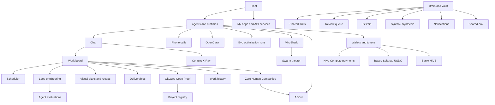

# Feature Guide

HivemindOS is a control room for local agent fleets.

The feature surface follows the work an operator actually does: connect machines, configure agents, run work, preserve memory, manage money rails, and keep the local system healthy.

<section class="atlasHero">
  <strong>Use this page as the operator map.</strong>
  
Each section below explains what the feature area is responsible for, which docs go deeper, and how the pieces connect in the running app. For the full visual pass, use the <a href="../diagrams.html">Diagrams And Maps</a> atlas.

</section>

  <section class="signalCard"><strong>Connect</strong>Fleet, collectors, Tailnet/Link, apps, and runtime discovery.</section>
  <section class="signalCard"><strong>Operate</strong>Agents, chat, Work board, Code Proof, Scheduler, Swarm, and deliverables.</section>
  <section class="signalCard"><strong>Verify</strong>Completion checks, trusted evidence, independent reviewers, and honest unobserved states.</section>
  <section class="signalCard"><strong>Remember</strong>Obsidian vault, shared skills, QMD, Neo4j, GBrain, Syntho, Synthesis, and notifications.</section>
  <section class="signalCard"><strong>Pay</strong>Wallets, crypto rail routing, Base/Robinhood/Solana, USDC/USDG, Hive Compute, Honey, HIVE, and x402.</section>
  <section class="signalCard"><strong>Integrate</strong>GitLawb, MiroShark, app connections, GitHub OAuth, My Apps, phone, and work history.</section>
  <section class="signalCard"><strong>Maintain</strong>Hivemind Sync, runtime files, native helpers, memory telemetry, and repair checks.</section>

## Control Room

The product starts with machines and agents. Fleet tells you what is online, which collectors are reachable, what runtimes and apps are available, and whether a machine is drifting from the expected setup. Agents and Chat turn those runtimes into configured workers with models, env, wallets, vault context, file attachments, and session history.

  <section class="docCard">
    <h3>Fleet</h3>
    
Machine discovery, local and remote collectors, version drift, setup actions, active app badges, and hivenet API route catalogs.

    <a href="fleet.html">Open Fleet</a>
  </section>
  <section class="docCard">
    <h3>Fleet Machine Permissions</h3>
    
Collector-only machines, per-capability Allow/Ask/Deny controls, master-hub authority, approval handoffs, and CPU/RAM/storage routing limits.

    <a href="fleet-machine-permissions.html">Open machine permissions</a>
  </section>
  <section class="docCard">
    <h3>SRE Incident Investigations</h3>
    
Redacted durable incident bundles, Fleet Watchdog escalation evidence, optional local OpenSRE root-cause reports, and a hard boundary between recommendations and approved actions.

    <a href="sre-investigations.html">Open SRE investigation docs</a>
  </section>
  <section class="docCard">
    <h3>Agents, Runtimes, And Chat</h3>
    
Runtime profiles, model selection, adaptive free-model routing, adapter behavior, streaming chat, `/swarm [number]` agent-team passes, `/swarm-goal` build orchestration, attachments, directory context, and phone-call handoff.

    <a href="runtimes-and-chat.html">Open agents</a>
  </section>
  <section class="docCard">
    <h3>Local Document Reader</h3>
    
Sixteen bundled file extensions, local native conversion, Chat attachments, Hive Vault Feed the brain imports, company data rooms, archive limits, and trust boundaries.

    <a href="local-document-reader.html">Open document reader</a>
  </section>
  <section class="docCard">
    <h3>Hivemind Office Companion</h3>
    
Optional visual DOCX, spreadsheet, presentation, and PDF review with local MCP tools, hash-bound handoffs, copy-first saves, explicit replacement confirmation, and verified backups.

    <a href="hivemind-office.html">Open office companion docs</a>
  </section>
  <section class="docCard">
    <h3>Local Web Research</h3>
    
Runtime-independent keyless search, guarded page extraction, bounded site crawling, screenshots, scanned-PDF OCR, and public-network safety controls.

    <a href="web-research.html">Open web research</a>
  </section>
  <section class="docCard">
    <h3>Capability Plan Approvals</h3>
    
Review the installed and setup-required capabilities behind a chat build, choose alternatives, remove entire task steps, and control when autonomous work should ask first.

    <a href="capability-approvals.html">Open capability approvals</a>
  </section>
  <section class="docCard">
    <h3>Calling</h3>
    
Dashboard and mobile agent calls, BYOK Realtime by default, speaker-only fallback, phone pairing, and paid LiveKit/SFU cloud rooms.

    <a href="calling.html">Open calling docs</a>
  </section>
  <section class="docCard">
    <h3>Socials</h3>
    
Connected accounts, per-account posting voice, durable drafts and schedules, explicit approvals, awake hours, cancellation windows, delivery-safe retries, history, and platform analytics.

    <a href="socials.html">Open Socials</a>
  </section>

## Looped Work

Looped work is where operator intent turns into agent execution. A loop contract can start from chat, Scheduler, Queen Bee, Evo, a company launch, or the Work Board. The board remains one access path: it captures rough ideas, promotes ready tasks, tracks claimed work, stores comments and run records, and turns finished output into deliverables. HivemindOS evaluates managed completions so agents do not get credit just for saying done. Zero Human Companies add a company cockpit with two autonomy choices: the default HivemindOS crew engine uses the Work Board and private learning loops, while the optional AEON engine runs one saved background skill and records accepted handoffs in Company Runs. Scheduler adds repeated background work. Chat can launch `/swarm [number]` agent-team passes for parallel role-specific analysis, or `/swarm-goal <build request>` to rewrite a loose build request and hand it to Queen Bee for parallel agent execution. Swarm and MiroShark handle rehearsal, `/swarm-sim` simulations, and heavier analysis workflows.

  <section class="docCard">
    <h3>Zero Human Companies</h3>
    
Agent-run company cockpits with charters, apex goals, approvals, budgets, kill switches, Company Runs, and either a HivemindOS crew or an optional AEON background skill.

    <a href="zero-human-companies.html">Open company docs</a>
  </section>
  <section class="docCard">
    <h3>Work Board And Scheduler</h3>
    
Kanban tasks as one loop access path, generic loop contracts, templates, eval gates, project provenance, Code Proof badges, agent dispatch, deliverables, schedules, machine-aware folder picking, background jobs, and work history.

    <a href="work-and-scheduler.html">Open work docs</a>
  </section>
  <section class="docCard">
    <h3>Loop Engineering</h3>
    
Pattern registry, readiness levels, budgets, receipts, human gates, and exportable loop snapshots for bounded autonomous work.

    <a href="loop-engineering.html">Open loop docs</a>
  </section>
  <section class="docCard">
    <h3>Agent Evaluations</h3>
    
Shared completion checks across chat, Work Board, companies, schedules, and managed runtime tasks, with trusted evidence and separate reviewers for consequential work.

    <a href="agent-evaluations.html">Open evaluation docs</a>
  </section>
  <section class="docCard">
    <h3>Harness Experiments</h3>
    
Fixed-worker baseline and treatment comparisons with context lifecycle evidence, real outcome grading, repeat thresholds, and retain, revise, or remove decisions.

    <a href="harness-experiments.html">Open harness docs</a>
  </section>
  <section class="docCard">
    <h3>Agent Challenges</h3>
    
Bounded multi-agent objectives with public challenge boards, credited lineage, per-agent run caps, verifier rulings, significance thresholds, and shared playbooks.

    <a href="agent-challenges.html">Open challenge docs</a>
  </section>
  <section class="docCard">
    <h3>Quant Research Swarm</h3>
    
Research-only hypothesis families with lagged Rust backtests, independent Python validation, hard overfitting gates, regime and factor audits, and durable lineage.

    <a href="quant-research.html">Open quant research docs</a>
  </section>
  <section class="docCard">
    <h3>Penny-stock Limit-order Paper Lab</h3>
    
Rank ten listed low-priced stocks, document a reasoned three-name paper basket, model standing limit fills, and retain strategy changes only after three forward windows pass every gate.

    <a href="penny-stock-paper-lab.html">Open the paper-lab docs</a>
  </section>
  <section class="docCard">
    <h3>MiroShark And Runtime Gateways</h3>
    
Simulation templates, `/swarm-sim` chat launches, swarm rehearsal, run intelligence, route catalogs, and the minimal runtime-gateway integration points HivemindOS owns.

    <a href="miroshark-and-openclaw.html">Open gateway docs</a>
  </section>
  <section class="docCard">
    <h3>Evo Optimization Runs</h3>
    
Benchmark-driven optimization loops as a managed runtime: gated experiment trees in git worktrees, Hermes-hosted orchestration, experiment status and dashboard discovery, and fleet machines as remote SSH backends.

    <a href="evo-optimization.html">Open Evo docs</a>
  </section>

## Code Proof

Agent work gets messy fast if the only record is a chat transcript or a commit message. HivemindOS keeps the private trail: which task was opened, which project it belonged to, which machine handled it, and which agent touched it. GitLawb adds the part that code needs, signed provenance.

The goal is not to make every user manage a code node on day one. The normal path is quieter than that. HivemindOS can be Code Proof ready during setup, tasks can attach to projects, and linked projects can carry GitLawb proof metadata. If a project later needs local repo hosting, the deeper GitLawb node path is there.

That gives the Work board a better answer than “an agent changed something.” It can point to the project, the task, the machine, and the proof trail behind the code.

  <section class="docCard">
    <h3>GitLawb Integration</h3>
    
The full integration guide for CLI setup, local DID identity, project links, proof badges, Fleet Code Node status, and lazy node hosting.

    <a href="../integrations/gitlawb.html">Open GitLawb docs</a>
  </section>
  <section class="docCard">
    <h3>Work Board Details</h3>
    
How project IDs and sanitized proof records move through tasks without leaking private vault paths, secrets, or machine details.

    <a href="work-and-scheduler.html">Open Work docs</a>
  </section>

## Shared Brain

The shared brain is a normal Obsidian vault, not a proprietary database. HivemindOS writes durable state into that vault when available: Kanban records, notifications, scheduled runs, wallet records, shared skills, service notes, and reviewed outputs. Agent Memory supports entity-linked recall, canonical memory heads, temporal history, and soft retrieval telemetry; high-volume operational events stay in a separate bounded local journal and only become durable knowledge through review. QMD, GBrain, Neo4j, Syntho, and Trading Brain stay optional service layers around the vault.

  <section class="docCard">
    <h3>Brain, Vault, And Skills</h3>
    
Obsidian vault routing, entity-linked memory, temporal recall, compiled wiki search, graph access, shared skills, QMD, Neo4j, GBrain, Syntho, Trading Brain, Synthesis, OKF export, and sync ownership.

    <a href="brain-vault-and-skills.html">Open brain docs</a>
  </section>
  <section class="docCard">
    <h3>Shared Brain Benchmarks</h3>
    
Measured recall quality, authenticated API latency, scale, full-vault speedups, contradiction control, pattern precision, and live token reduction.

    <a href="shared-brain-benchmarks.html">Open benchmark scorecard</a>
  </section>
  <section class="docCard">
    <h3>Agent-Native Workflows</h3>
    
Action metadata, dashboard pins, Shared Brain review proposals, Context X-Ray manifests, and visual plan/recap artifacts.

    <a href="agent-native-workflows.html">Open workflow docs</a>
  </section>
  <section class="docCard">
    <h3>Hive Fusion</h3>
    
Capability search plus skill authoring: turn a normal prompt into a reusable shared-brain skill built from the agents, apps, tools, and workflows the hive already has.

    <a href="hive-fusion.html">Open fusion docs</a>
  </section>
  <section class="docCard">
    <h3>Packaged Skills</h3>
    
HivemindOS-owned Hive skills, third-party packaged skills, auto-install policy, optional catalog rules, and skill maintenance contracts.

    <a href="../packaged-skills/">Open packaged skills</a>
  </section>
  <section class="docCard">
    <h3>Whole Brain</h3>
    
The separated GitHub Pages guide for vault structure, compiled knowledge, brain services, OKF exchange bundles, shared skills, sync health, and architecture sync rules.

    <a href="../whole-brain/">Open whole brain</a>
  </section>
  <section class="docCard">
    <h3>Hivemind Sync</h3>
    
The cross-machine route for shared brain files, shared env keys, and vault-backed handoff transfers.

    <a href="hivemind-sync.html">Open sync docs</a>
  </section>
  <section class="docCard">
    <h3>Env, Files, Notifications, And Maintenance</h3>
    
Shared env, runtime file browsing, notification storage, process telemetry, and conservative repair checks.

    <a href="env-files-notifications-maintenance.html">Open system docs</a>
  </section>
  <section class="docCard">
    <h3>Token And Cost Savings</h3>
    
How shared brain recall, Hive skills, assimilation, fusion workflows, model routing, and usage analytics reduce repeated token spend.

    <a href="token-and-cost-savings.html">Open savings docs</a>
  </section>

## Economy And Integrations

Wallet and token features are explicit rails, not a background permission pool. Agent wallets handle controlled Base, Robinhood Chain, and Solana balances plus x402 paid requests, including HivemindOS Models calls paid directly from a local wallet without user API keys. The crypto capability router lets agents ask for intents such as paid API, private transfer, tokenized stock trade, or Bankr trading, then select or prepare the configured rail without executing spending itself. Hive Compute is an experimental marketplace inference and spare-GPU hosting path. Honey is one cumulative record of verified contribution and bounded recognition, Hivemind Cloud credits pay for managed service usage, and HIVE remains an optional community/payment rail. Integrations connect the control room to outside systems without making those systems own local state.

  <section class="docCard">
    <h3>Wallets, Tokens, Honey, HIVE, And x402</h3>
    
Agent wallets, crypto rail routing, USDC/USDG sends, MoneyClaw, wallet-paid HivemindOS Models, wallet-vault backups, Honey contribution records, Hivemind Cloud credits, optional HIVE payment paths, and stock buying via Alpaca, Robinhood Agentic brokerage, xStocks, or Robinhood Chain Stock Tokens.

    <a href="wallets-honey-and-x402.html">Open wallet docs</a>
  </section>
  <section class="docCard">
    <h3>Agent-Analyzed Copy Trading</h3>
    
Pair an unchanged copy-trader with a GPT-5.6 Sol research twin, review each copied buy after execution, close rejected positions, and compare both returns through an EVO-ready sample gate.

    <a href="copy-trading-agent-analysis.html">Open copy-trading analysis docs</a>
  </section>
  <section class="docCard">
    <h3>Hive Compute</h3>
    
Marketplace model inference, spare-GPU hosting, LM Studio or Ollama-backed job serving, x402 and MPP payment rails, and the hosted authority boundary for balances, payouts, and quotas.

    <a href="hive-compute.html">Open compute docs</a>
  </section>
  <section class="docCard">
    <h3>Managed Cloud Agents</h3>
    
Dedicated always-on Hermes agents with persistent workspaces, governed Base USDC funding, browser chat, and running or stopped metering.

    <a href="managed-cloud-agents.html">Open cloud agent docs</a>
  </section>
  <section class="docCard">
    <h3>App Builder And Web Hosting</h3>
    
Go from a prompt to a working app on your own machine or a managed agent, preview it locally, share a free 60-minute test build, and publish static or dynamic Sites on a stable HivemindOS URL.

    <a href="app-builder.html">Build and publish an app</a>
  </section>
  <section class="docCard">
    <h3>HivemindOS Machines</h3>
    
Pre-initialized Azure Marketplace virtual machines in the user's own subscription, with transparent Microsoft billing for infrastructure and the HivemindOS software fee.

    <a href="hivemindos-machines.html">Open machine docs</a>
  </section>
  <section class="docCard">
    <h3>Monetization</h3>
    
The free-vs-paid product boundary, including HivemindOS Cloud Agent Calls as a premium managed LiveKit feature.

    <a href="../../for-investors/">Open monetization</a>
  </section>
  <section class="docCard">
    <h3>Integrations And Work History</h3>
    
GitLawb Code Proof, app connections, GitHub OAuth, My Apps, API-service launchers, phone pairing, dynamic changelog, and work history.

    <a href="integrations-and-work-history.html">Open integrations</a>
  </section>
  <section class="docCard">
    <h3>X Command Bot</h3>
    
Bind a numeric X identity to shared Mini credits, invoke allowlisted apps such as X Transcript, and route read-only questions to an explicitly paired local Queen.

    <a href="x-command-bot.html">Open X bot docs</a>
  </section>
  <section class="docCard">
    <h3>Beeline Family Profiles</h3>
    
Separate family identities, explicit authority, allowed capability areas, and dedicated Chrome profiles without mixing them with your own account set.

    <a href="beeline.html">Open Beeline</a>
  </section>
  <section class="docCard">
    <h3>Agent Provider Integrations</h3>
    
External agent providers, MCP catalog discovery, Hivemind Office, Browser Use, OpenHands, Aider, n8n, Agentic Inbox, and Queen Bee PRD decomposition.

    <a href="agent-provider-integrations.html">Open provider docs</a>
  </section>
  <section class="docCard">
    <h3>Computer Interaction</h3>
    
Governed dashboard and browser operation with semantic-first routing, allowed domains and apps, fresh observations, consequence approvals, durable redacted receipts, and post-action verification.

    <a href="computer-interaction.html">Open computer interaction docs</a>
  </section>

## Native And Background Surfaces

The browser and native app share the same Next.js UI. Tauri adds local filesystem and status helpers on This Mac, while AEON and Hermes keep their runtime-specific setup and background work docs separate.

  <section class="docCard">
    <h3>Native App</h3>
    
Tauri development shell, packaged Next server, native status bridge, and desktop filesystem helpers.

    <a href="../native-app.html">Open native docs</a>
  </section>
  <section class="docCard">
    <h3>AEON For Zero Human Companies</h3>
    
Choose a saved AEON workspace and skill as an optional company engine, understand the authority boundary, and monitor accepted handoffs without requiring a native crew.

    <a href="../runtimes/aeon/zero-human-companies.html">Open the AEON company guide</a>
  </section>
  <section class="docCard">
    <h3>AEON Brain Access</h3>
    
GitHub Actions tailnet brain access with visibility-scoped policy and OIDC-gated brain endpoint calls.

    <a href="../runtimes/aeon/github-actions-brain-access.html">Open AEON docs</a>
  </section>
  <section class="docCard">
    <h3>Hermes Local Setup</h3>
    
Local Hermes runtime setup notes for running interactive agent work beside the HivemindOS dashboard.

    <a href="../runtimes/hermes/local-setup.html">Open Hermes docs</a>
  </section>

## Feature Map

