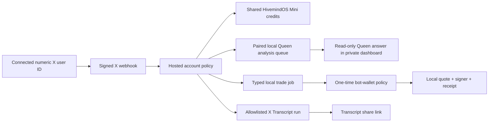

# X Command Bot

The X Command Bot lets an X account you connect to HivemindOS analyze the post it is replying to, execute bounded stock or token orders from one app-selected wallet, invoke allowlisted Mini apps, and ask its paired Queen Bee a natural read-only question by mentioning the dedicated bot account.

The listener is intentionally disabled until the dedicated bot account, X developer credentials, webhook subscription, and required X automation approval are installed.

## What Is Bound To What



The durable identity boundary is the numeric X user ID, not the handle. The bot reuses the managed X OAuth connection already owned by the same hosted credit account. It does not ask users to paste X tokens into the app and does not keep a second user-token copy.

## Set It Up

1. Open [HivemindOS Mini](https://hivemindos.app/mini/) and fund or restore the shared credit account.
2. In the HivemindOS app, open **Integrations → X Bot**. The X Bot page shows the selected hosted credit balance and starts managed X OAuth directly, so you do not need to find the MCP panel.
3. Select the connected X account, set the maximum automatic paid command, explicitly enable commands, and save.
4. Press **Choose wallet** to open the normal HivemindOS wallet selector. Pick one local signing wallet, set the per-trade, rolling 24-hour, and slippage limits, enable bounded automatic trades, and save the one-time authorization.
5. Pair this HivemindOS app. Once the dedicated bot is live, mention it from the connected X account.

Set the paid-command cap to `$0` to disable paid Mini runs. Disabling the account policy stops all commands. Mentioning the bot with `stop` creates an immediate account-level opt-out; `start` clears the opt-out but does not create a connection or enable a missing policy.

## Commands

Replace `@bot` with the live bot handle:

```text
Reply to a post: @bot what do you think about this post?
Reply to a token post: @bot what do you think of this token?
@bot buy $5 of ETH
@bot buy $5 of AAPL stock
@bot buy $5 of 0x…contract
Reply to a video post: @bot transcript
```

Normal questions no longer need an `ask queen` prefix. Reply-context analysis looks up the exact parent post through X before it reaches the paired Queen. `stop` remains the immediate safety opt-out, and `start` clears that opt-out when the account policy is still valid.

Buy and sell wording creates a typed job for the paired app. The app automatically chooses the compatible account and network inside the selected HivemindOSBot wallet, gets a live quote, applies the one-time limits, signs locally, and records a receipt. There is no per-order approval prompt after that authorization. Contract-address and mint buys are supported when the address matches a supported account in the selected wallet and an executable route exists.

## Safety Boundaries

- The webhook must be signed by X and addressed to the configured bot user ID.
- A source post ID can create only one command job, which is the replay boundary.
- Only one public reply is attempted per interaction. An ambiguous delivery is recorded as unknown and is not retried.
- X Transcript resolves its price server-side and rejects the job before credit reservation when the price exceeds the account cap.
- Post and token analysis jobs can be claimed only by a paired device token. The desktop bridge forces tool choice off, suppresses wallet intents, and instructs Queen not to spend, post, message, mutate files, invent missing live data, or claim an external action.
- The hosted X gateway imports no broker, signer, or wallet executor. It can only queue a typed job for a paired device. Wallet secrets never leave the local HivemindOS wallet vault.
- The HivemindOSBot wallet authorization is separate from ordinary manual-trade confirmation. It binds a selected wallet, supported accounts, per-trade limit, rolling daily limit, and maximum slippage. Manual Trade-desk routes keep their existing confirmation behavior.
- A paired device reports trade capability only while its local bot-wallet policy is enabled. Devices without one continue to serve read-only Queen work but cannot claim trade jobs.
- Before signing, the local bridge validates the exact job, wallet identity, policy revision, network compatibility, amount, live route, and limits. Missing assets, unknown or incompatible addresses, missing liquidity, changed keys, stale authorization, and cap violations fail closed.
- The source X job ID is the local idempotency key. A reservation is written before execution. Completed duplicates return the existing receipt; started or uncertain duplicates are never resubmitted automatically.
- Trade jobs expire after five minutes if no authorized local device claims them. A claimed trade is never requeued when its device stops responding, and the local signer independently rejects stale jobs.
- Queen answers remain private in the authenticated command dashboard. AI-generated public replies remain unavailable unless X gives written approval and the hosted operator deliberately enables that separate mode.
- Revoking a paired device prevents future claims. Local device credentials are encrypted at rest in the HivemindOS data directory with owner-only file permissions.

The X command lane does not expose arbitrary Mini app names, wallet transfers, posting as the connected user, file access, or arbitrary tools. Trading is limited to the supported stock/token intents and the bounded local HivemindOSBot wallet policy.

## Where Results Appear

The authenticated [X Command Bot dashboard](https://hivemindos.app/x-bot/) shows recent commands, Queen answers, errors, reply status, and transcript links. Transcript links may be shared; Queen answers and command history remain behind the HivemindOS Mini account session or hosted credit credential.

The desktop X Bot panel additionally shows the hosted credit balance, managed X connect action, selected HivemindOSBot wallet, automatic-trade limits, local bridge state, and device pairing or revocation.
