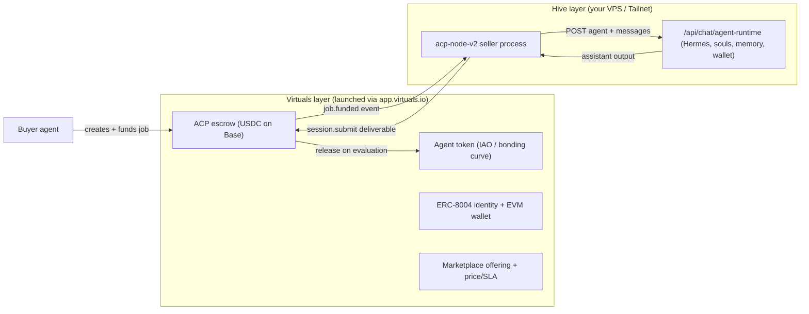

# Virtuals × HivemindOS — launch on Virtuals, run the brain on Hive

## The question

> "Being able to launch an agent on Virtuals and select Hive as the infra would be cool as hell."

Is that possible? **Yes — partly, and the cleanest path does not depend on the uncertain bits.**

This is a different question from "can HivemindOS mint a token by API" (it can't — agent
token launch is web-app-only). What's being asked is: **launch through Virtuals' web app, but
make HivemindOS the brain/runtime behind the listed agent.** That is supported.

## The key unlock

Virtuals **decouples the token / identity / commerce layer from where cognition actually runs.**
Confirmed against primary source (whitepaper + SDK repos):

- The whitepaper documents an explicit **"Self-Hosted"** launch type and a **"Terminal API for
  non-GAME framework agents"**. Tokenization is *not* gated on using Virtuals' hosted brain.
- **ACP (Agent Commerce Protocol) is explicitly bring-your-own-brain.** The provider runs
  `@virtuals-protocol/acp-node-v2` as a **local Node process in your own infra**, listens for
  `job.funded` events over WebSocket, executes the work however it likes, and returns a
  deliverable. Virtuals only coordinates discovery + escrow.
- Real precedent: **AIXBT** (proprietary off-platform engine, token on Virtuals) and **ElizaOS**
  agents tokenized on Virtuals.

## The four seams (ranked)

| # | Path | Launches on Virtuals | Hive provides | Confidence |
|---|------|----------------------|---------------|------------|
| **1** | **ACP Provider** (chosen) | ERC-8004 identity + wallet, marketplace offering, escrow, optional tradeable token | A long-lived `acp-node-v2` seller on the Hive box; on `job.funded` it calls Hive and returns a deliverable | ✅ Proven, officially supported |
| 2 | x402 paywalled endpoint | Identity/listing + payment rail | A Hive endpoint wrapped in x402 middleware (rails already exist) | ✅ Proven |
| 3 | GAME agent, capability via Functions | GAME shell + token | GAME `Functions` whose code `fetch()`es Hive — Hive supplies the *hands* | ✅ Proven (planner still on Virtuals) |
| 4 | GAME agent, custom LLM → Hive | GAME shell; Virtuals dials your model URL | Token completions for GAME's planner via a public OpenAI endpoint | ⚠️ **Needs a spike** |

**Why path 1 wins:** it is officially supported, has **no dependency on Virtuals' closed
backend**, and the seller is an **outbound client** — so it runs fine from a private/Tailnet host
with no public exposure. Paths 2 and 4 require Hive to be publicly reachable. Path 4 additionally
depends on Virtuals' closed server actually honoring `model_base_url` (unverified) **and** a Hive
OpenAI `/v1/chat/completions` server that does not exist today (see "What Hive is missing").

## Architecture (chosen: ACP Provider)



The binding seam is exactly one thing: the seller's `job.funded` handler calls Hive's existing
agent-runtime endpoint and submits the result as the deliverable.

## What Hive already provides (verified in repo)

- `POST /api/chat/agent-runtime` — accepts `{ agent: AgentProfile, messages: IncomingMessage[],
  wallet?, sharedVault?, agentMode? }` and streams **OpenAI-shaped SSE**
  (`choices[].delta.content`, `data: [DONE]`).
  See [agent-runtime/route.ts:4265](../../../src/app/api/chat/agent-runtime/route.ts#L4265).
- Base + Solana wallet rails, x402, spend-governance and the encrypted wallet vault — reusable for
  paths 1 and 2.

## What Hive is missing (only matters for path 4)

Hive is an OpenAI-compatible **consumer/router**, not a **server**: the agent-runtime route emits
OpenAI-shaped SSE but its *request* body is bespoke (`{ agent, messages, wallet, … }`), and there
is no `/v1/chat/completions` route. Path 4 would need a thin shim + public exposure. **Path 1 needs
neither**, which is why we start there.

## The testnet spike (cheapest proof, no public exposure, no mainnet spend)

Goal: prove "Hive is the brain behind a Virtuals-listed agent" end-to-end on **Base Sepolia
(84532)**.

1. **Install tooling** (pnpm; the seller script lives at
   [scripts/virtuals-acp-seller.mjs](../../../scripts/virtuals-acp-seller.mjs)):
   ```bash
   pnpm add -D @virtuals-protocol/acp-node-v2 viem
   npm i -g @virtuals-protocol/acp-cli   # or pnpm dlx
   ```
2. **Provision the agent identity** with `acp-cli`:
   ```bash
   acp configure
   acp agent create
   acp agent add-signer
   acp agent register-erc8004 --chain-id 84532   # Base Sepolia
   acp offering create
   ```
   This yields a wallet address, wallet id, signer private key, and an entity/agent id.
3. **Store secrets in shared hive env (never in the repo):**
   ```bash
   hive-env-add SELLER_WALLET_ADDRESS ...
   hive-env-add SELLER_WALLET_ID ...
   hive-env-add SELLER_SIGNER_PRIVATE_KEY ...
   ```
4. **Export an agent profile** from the dashboard to a JSON file and point `HIVE_AGENT_PROFILE_JSON`
   at it (gives the seller a real `AgentProfile` to send to the runtime).
5. **Run the seller against shared env**, with the Hive dev server running locally:
   ```bash
   hive-env-run -- node scripts/virtuals-acp-seller.mjs
   ```
6. **Self-fund a test job** from the buyer side and confirm the round-trip:
   `job.created → job.funded → Hive executes → session.submit(deliverable) → escrow released`.

If the round-trip works, "Hive as the brain" is proven. Mainnet token launch and the GAME paths
are separate, later decisions.

## Open questions / blockers (confirm before mainnet or real funds)

- **Evaluator role & deliverable format** — whether an Evaluator gates escrow release, and what
  deliverable shapes are accepted (URL vs inline). The scaffold submits a URL/string; confirm.
- **Smart-wallet mismatch** — ACP uses Privy/Alchemy smart accounts (peer deps `viem` +
  `@account-kit/infra`); Hive uses raw AES-256-GCM local keypairs. The spike uses the acp-cli /
  Privy wallet for the *seller identity only*; Hive's own wallet rails are untouched.
- **`acp-node-v2` license** — unconfirmed; verify before shipping it in production code.
- **`Self-Hosted` launch flow** — whether it's fully self-serve or reviewed/whitelisted; the live
  Console wording was inferred from the whitepaper export, not directly observed.
- **Billing** — whether per-inference `$VIRTUAL` charges apply when Hive serves the tokens.
- **Beta churn** — ACP is a 2026 public beta; v1 (`@virtuals-protocol/acp-node`) is already
  deprecated/archived. Build only on `acp-node-v2`.

## Needs the operator (not codeable autonomously)

A Virtuals/GAME Console account, a testnet EVM wallet + signer keys via `acp-cli`, Base Sepolia
test funds, and an exported agent profile JSON. The seller scaffold and this runbook are ready;
provisioning those credentials is the human step.

## Sources

Adversarially verified against raw source: `Virtual-Protocol/acp-node-v2` (local Node seller,
socket.io job stream, `session.submit` deliverable), `Virtual-Protocol/acp-cli`
(configure / agent create / add-signer / register-erc8004 / offering create / `acp agent
tokenize`), `Virtual-Protocol/acp-x402-server`, `game-by-virtuals/game-node` (BYOM
`llmModelBaseUrl` exists but planner host hardcoded), `whitepaper.virtuals.io/llms-full.txt`
(Console-Hosted vs Self-Hosted, API-only provider, token/infra decoupling). Hive side inspected in
this repo (`src/app/api/chat/agent-runtime/route.ts`).
