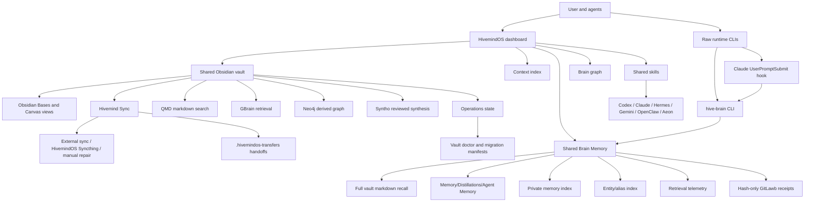

# Whole Brain

The HivemindOS whole brain is the shared memory, retrieval, skill, and coordination system for the fleet.

It is not one magic database. The real anchor is a normal Obsidian markdown vault. Everything else either reads it, writes to it, indexes it, repairs it, or helps agents use it without making a mess.

<section class="atlasHero">
  <strong>Short version:</strong>
  <p>The vault is the durable shared brain. Shared Brain Memory gives agents private millisecond typed-memory recall first, entity-linked canonical memory heads, temporal history, memory evolution when reviewed facts replace stale ones, then broader full-vault context retrieval when distilled memory is not enough. High-volume operational events stay in a separate bounded local journal and can generate review-gated memory, skill, or job proposals without automatically applying them. Compiled Knowledge turns reviewed source material into searchable entity/concept/summary wiki pages with graph-native lookups. OKF export turns selected memory and conversation notes into a portable markdown bundle for outside agents and catalog tools. The Obsidian Native Brain Pack gives agents shared skills for Markdown, Bases, and Canvas, while optional brain services such as QMD, GBrain, and Neo4j can index, compile, visualize, or query the vault without replacing it.</p>
</section>

## Component Pages

<div class="docGrid">
  <section class="docCard">
    <h3>Vault Map</h3>
    <p>The canonical folders, what belongs where, and which paths are operational state.</p>
    <a href="vault-map.html">Open vault map</a>
  </section>
  <section class="docCard">
    <h3>Brain Services</h3>
    <p>Shared Brain Memory, Compiled Knowledge search, OKF exchange bundles, Neo4j, GBrain, Syntho, Trading Brain, the Brain Graph, the context index, and service notes.</p>
    <a href="brain-services.html">Open services</a>
  </section>
  <section class="docCard">
    <h3>Memory Benchmarks</h3>
    <p>Public scorecards for live recall, local API latency, typed-memory scale, full-vault search, truth maintenance, pattern mining, and token reduction.</p>
    <a href="../features/shared-brain-benchmarks.html">Open benchmarks</a>
  </section>
  <section class="docCard">
    <h3>Shared Skills</h3>
    <p>The shared skill shelf, provider mirrors, auto sync policy, and test cleanup rules.</p>
    <a href="shared-skills.html">Open shared skills</a>
  </section>
  <section class="docCard">
    <h3>Packaged Skills</h3>
    <p>Repository-shipped Hive skills, third-party packaged skills, auto-install behavior, and optional skill boundaries.</p>
    <a href="../packaged-skills/">Open packaged skills</a>
  </section>
  <section class="docCard">
    <h3>Shared Env</h3>
    <p>Where agent secrets live, how hive env helpers work, and why plaintext keys stay out of the vault.</p>
    <a href="shared-env.html">Open shared env</a>
  </section>
  <section class="docCard">
    <h3>Workspaces</h3>
    <p>Named whole-brain bundles for separate vaults, env files, skill shelves, and memory indexes.</p>
    <a href="workspaces.html">Open workspaces</a>
  </section>
  <section class="docCard">
    <h3>Sync And Health</h3>
    <p>Hivemind Sync, vault doctor, conflict cleanup, secure backups, and migration manifests.</p>
    <a href="sync-and-health.html">Open sync docs</a>
  </section>
  <section class="docCard">
    <h3>Architecture Sync</h3>
    <p>The rule that keeps setup, vault structure, agent instructions, tests, and docs aligned.</p>
    <a href="architecture-sync.html">Open sync rules</a>
  </section>
  <section class="docCard">
    <h3>Code Map</h3>
    <p>The source files and API route families that own brain behavior.</p>
    <a href="code-map.html">Open code map</a>
  </section>
</div>

## Mental Model



The important split is access path, not storage path:

- HivemindOS-managed chats inject Shared Brain Memory through the dashboard runtime context.
- Raw or non-managed runtimes use `hive-brain`, which tries `/api/brain/memory` first and falls back to local vault/index search.
- Claude Code also gets `hive-brain-hook` as a `UserPromptSubmit` hook, so raw Claude prompts can receive relevant full-vault context before answering.
- Durable memory writes go to typed Agent Memory notes with canonical `memoryKey` heads; `record-operation` keeps run receipts out of durable recall; `hive-brain evolve` preserves superseded memory history when reviewed context changes; temporal recall can include older chain entries; broad recall can read normal vault notes when the typed layer is not enough.
- OKF export writes selected memory and conversation concepts to `Operations/Brain Services/OKF Export/` for outside agents, catalogs, and graph tools without changing the native vault.
- The Obsidian Native Brain Pack lets agents write durable notes, `.base` views, and `.canvas` maps in formats Obsidian can open directly.

## Source Of Truth

The durable source of truth is the configured vault, usually:

```text
~/Documents/Obsidian/hivemindos-vault
```

Fresh installs seed this structure through the setup scripts and foundation seeder. Existing installs can run:

```bash
pnpm vault:doctor
pnpm vault:doctor -- --fix
```

The doctor is read only unless `--fix` is passed. Fixes move content into canonical folders or archive stale artifacts under `Operations/Vault Migrations/`.

## Read Next

- [Vault Map](vault-map.html)
- [Brain Services](brain-services.html)
- [Memory Benchmarks](../features/shared-brain-benchmarks.html)
- [Packaged Skills](../packaged-skills/)
- [Shared Env](shared-env.html)
- [Workspaces](workspaces.html)
- [Sync And Health](sync-and-health.html)
- [Architecture Sync](architecture-sync.html)
