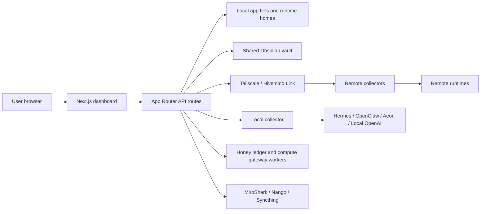

<section class="heroPanel">
  <div>
    <p class="eyebrow">Local-first fleet manual</p>
    <h1>HivemindOS Documentation</h1>
    <p class="lede">A compact operator map for agent fleets: local machines, Tailnet collectors, shared Obsidian memory, runtime adapters, background work, wallets, Honey, HIVE, simulations, and integration surfaces.</p>
    <div class="actionRow">
      <a href="features/">Read the feature guide</a>
      <a href="architecture/">Trace the architecture</a>
    </div>
  </div>
</section>

<ul class="statusStrip">
  <li>GitHub Pages ready</li>
  <li>Private Tailnet posture</li>
  <li>Next.js 16 / React 19</li>
  <li>Tauri desktop target</li>
  <li>Collector-first fleet model</li>
</ul>

## Start Here

<div class="docGrid">
  <section class="docCard">
    <h3>Feature Guide</h3>
    <p>Tour the product surface by domain: Fleet, agents, chat, work, scheduler, brain, env, files, notifications, MiroShark, wallets, Honey, HIVE, and x402.</p>
    <a href="features/">Open features</a>
  </section>
  <section class="docCard">
    <h3>Architecture</h3>
    <p>Follow the process boundaries, route groups, collector responsibilities, storage model, and safety-sensitive networking paths.</p>
    <a href="architecture/">Open architecture</a>
  </section>
  <section class="docCard">
    <h3>Runtime Guides</h3>
    <p>Review runtime-specific setup and behavior for Hermes, AEON, and the adapter layer that keeps runtime surfaces consistent.</p>
    <a href="runtimes/">Open runtimes</a>
  </section>
  <section class="docCard">
    <h3>Product Guidance</h3>
    <p>Keep the control room coherent with the design philosophy and UI rules that shape HivemindOS workflows.</p>
    <a href="product/">Open product docs</a>
  </section>
</div>

## Current Surface

The codebase now spans more than the original Fleet, Work, Brain, Chat, and Wallet shell. The current dashboard also includes:

- My Apps: hivenet app and API-service discovery with icon proxying, health checks, service-kind signatures, OpenAPI/Hivemind route catalogs, route copy actions, and safe open links.
- AEON: repository/workspace management, local clone/link flows, GitHub-backed duplicates, scheduler handoff, brain access, and deliverable discovery/download/transfer.
- Swarm: MiroShark template-driven simulations, scenario helpers, archive loading, X/polymarket/reddit-style outputs, run intelligence, publish actions, and analysis-agent selection.
- Brain Services: Obsidian graph, shared skills, GBrain, Synto, trading-brain install/status, service notes, Synthesis-folder configuration, and source-access policy controls.
- Wallets and Usage: per-agent wallet rails, MoneyClaw key validation, UsePod prepaid status, x402 smoke tests, encrypted wallet-vault backup/restore, Honey observation, and Bankr HIVE claims.
- Work History and Maintenance: dynamic changelog history, note-to-Kanban intake, bulk task triage, process/heap memory telemetry, and conservative local repair actions.
- Native Desktop: a Tauri shell that can read desktop status directly and use native local folder browsing/creation while preserving the browser API fallbacks.
- Phone: gateway-backed phone pairing, scheduled/ring-agent calls, dashboard LiveKit calls, AEON call context, and mobile push readiness checks.

## Repository Overview

The app is a Next.js 16 / React 19 project using the App Router. The primary dashboard lives in `src/features/dashboard`, route handlers live under `src/app/api`, runtime-specific logic lives under `src/lib/services`, native desktop adapters live under `src/lib/native` and `src-tauri`, and optional Cloudflare Workers live under `workers/`.

Core commands:

```bash
pnpm dev
pnpm lint
pnpm typecheck
pnpm build
```

Port `5020` is the normal managed dashboard port. Project rules reserve that port for Liam's managed dev server, so ad hoc testing should use `5021` or higher unless explicitly directed otherwise.

## Architecture At A Glance



## Current Audit Snapshot

This documentation reflects a code audit of the repository on 2026-06-01 WITA. The main code paths checked were:

- Dashboard shell and views: `src/app/page.tsx`, `src/features/dashboard/**`, `src/components/**`
- API facade: `src/app/api/**`
- Runtime adapters: `src/lib/services/runtime-adapters/**`
- Shared state services: `src/lib/services/kanban/**`, `src/lib/services/obsidian/**`, `src/lib/services/brain/**`
- Native desktop bridge: `src/lib/native/**`, `src-tauri/src/lib.rs`, `src-tauri/capabilities/default.json`
- Fleet/app discovery: `src/app/api/fleet/**`, `src/features/dashboard/views/MyAppsPanel.tsx`, `src/components/fleet/**`
- Scheduler, Swarm, AEON, Phone, and Integrations views: `src/features/dashboard/views/**`, `src/components/scheduler/**`, `src/components/swarm/**`
- Collector and setup scripts: `scripts/agent-telemetry-collector.mjs`, `setup.sh`, `uninstall.sh`
- Workers: `workers/honey-ledger`, `workers/compute-gateway`
