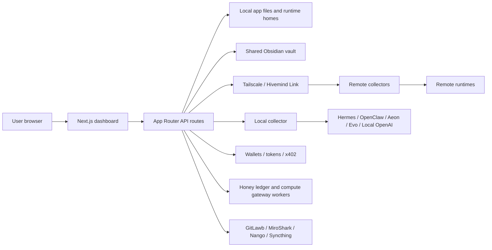

<section class="heroPanel">
  <div>
    <p class="eyebrow">Local-first fleet manual</p>
    <h1>HivemindOS Documentation</h1>
    <p class="lede">A compact operator map for agent fleets: local machines, Tailnet collectors, shared Obsidian memory, runtime adapters, background work, wallets, token rails, Honey, HIVE, simulations, and integration surfaces.</p>
    <div class="actionRow">
      <a href="./for-users/features/">Read the feature guide</a>
      <a href="./for-users/architecture/">Trace the architecture</a>
    </div>
  </div>
</section>

<ul class="statusStrip">
  <li>GitHub Pages ready</li>
  <li>Private Tailnet posture</li>
  <li>Next.js 16 / React 19</li>
  <li>Tauri desktop target</li>
  <li>Collector-first fleet model</li>
  <li>OKF brain export</li>
  <li>Compiled brain search</li>
</ul>

## Choose your path

<div class="docGrid">
  <section class="docCard">
    <h3>For Users</h3>
    <p>Run HivemindOS as a local-first agent fleet: fleet, agents, brain, work, wallets, trading, integrations, runtimes, and architecture.</p>
    <a href="./for-users/">Open the product docs</a>
  </section>
  <section class="docCard">
    <h3>For Investors</h3>
    <p>The business model: revenue streams, trading and on-chain fees, the free-vs-paid boundary, Honey and HIVE, treasury, and buybacks.</p>
    <a href="./for-investors/">Open the investor docs</a>
  </section>
</div>

<figure class="imagePlate imagePlateHero">
  
  <figcaption>The full control room map: fleet, agents, brain, work, wallets, and native desktop surfaces around the dashboard.</figcaption>
</figure>

## Start Here

<div class="docGrid">
  <section class="docCard">
    <h3>Feature Guide</h3>
    <p>Tour the product surface by domain: Fleet, agents, chat, Zero Human Companies, work, scheduler, brain, env, files, notifications, MiroShark, wallets, token rails, Honey, HIVE, and x402.</p>
    <a href="./for-users/features/">Open features</a>
  </section>
  <section class="docCard">
    <h3>Zero Human Companies</h3>
    <p>See how agent-run company cockpits connect charters, crews, apex goals, approvals, budgets, Work Board dispatch, and private learning loops.</p>
    <a href="./for-users/features/zero-human-companies.html">Open company docs</a>
  </section>
  <section class="docCard">
    <h3>Diagrams And Maps</h3>
    <p>Use the visual atlas for generated infographic plates, system flowcharts, wallet/token diagrams, trust boundaries, scheduler loops, runtime maps, and storage maps.</p>
    <a href="./for-users/diagrams.html">Open visual atlas</a>
  </section>
  <section class="docCard">
    <h3>Wallets And Tokens</h3>
    <p>Follow agent wallets, Base/Solana token handling, UsePod prepaid deposits, MoneyClaw keys, Honey rewards, Bankr HIVE claims, and x402 payments.</p>
    <a href="./for-users/features/wallets-honey-and-x402.html">Open wallet docs</a>
  </section>
  <section class="docCard">
    <h3>Trading</h3>
    <p>Every trading capability in one place — crypto swaps, sends, private transfers, x402, local Hyperliquid spot/perps, Bankr prediction/NFT/token-launch flows, and stock trading via Alpaca or on-chain xStocks, with governance and agent access.</p>
    <a href="./for-users/trading/">Open trading docs</a>
  </section>
  <section class="docCard">
    <h3>GitLawb Code Proof</h3>
    <p>See how HivemindOS keeps the private agent work trail while GitLawb proves the code that shipped.</p>
    <a href="for-users/integrations/gitlawb.html">Open GitLawb docs</a>
  </section>
  <section class="docCard">
    <h3>Architecture</h3>
    <p>Follow the process boundaries, route groups, collector responsibilities, storage model, and safety-sensitive networking paths.</p>
    <a href="./for-users/architecture/">Open architecture</a>
  </section>
  <section class="docCard">
    <h3>Whole Brain</h3>
    <p>Understand the shared Obsidian vault, canonical folder map, entity-linked memory, temporal recall, compiled wiki search, brain services, OKF export, shared skills, sync health, and architecture sync rules.</p>
    <a href="./for-users/whole-brain/">Open whole brain</a>
  </section>
  <section class="docCard">
    <h3>Packaged Skills</h3>
    <p>Review HivemindOS Hive skills, third-party packaged skills, auto-install policy, and optional skill boundaries.</p>
    <a href="./for-users/packaged-skills/">Open packaged skills</a>
  </section>
  <section class="docCard">
    <h3>Slash Commands</h3>
    <p>See dashboard, Hermes, gateway, CLI-only, and dynamic skill slash commands in one reference.</p>
    <a href="for-users/slash-commands.html">Open slash commands</a>
  </section>
  <section class="docCard">
    <h3>Hivemind Sync</h3>
    <p>See how shared brain files, shared env, and handoff transfers move between trusted machines.</p>
    <a href="./for-users/features/hivemind-sync.html">Open sync docs</a>
  </section>
  <section class="docCard">
    <h3>Runtime Guides</h3>
    <p>Review runtime-specific setup and behavior for Hermes, AEON, and the adapter layer that keeps runtime surfaces consistent.</p>
    <a href="./for-users/runtimes/">Open runtimes</a>
  </section>
  <section class="docCard">
    <h3>Token And Cost Savings</h3>
    <p>Learn how HivemindOS reduces repeated context, blank-page coding, workflow rediscovery, and paid-model spend.</p>
    <a href="./for-users/features/token-and-cost-savings.html">Open savings docs</a>
  </section>
  <section class="docCard">
    <h3>Calling</h3>
    <p>Call HivemindOS agents from the dashboard or paired mobile app, with BYOK Realtime calls by default and Cloud/LiveKit rooms as the paid path.</p>
    <a href="./for-users/features/calling.html">Open calling docs</a>
  </section>
  <section class="docCard">
    <h3>Monetization</h3>
    <p>See the free-vs-paid boundary, ecosystem plan, Honey and HIVE model, treasury strategy, and premium service paths.</p>
    <a href="./for-investors/">Open monetization docs</a>
  </section>
  <section class="docCard">
    <h3>Product Guidance</h3>
    <p>Keep the control room coherent with the design philosophy and UI rules that shape HivemindOS workflows.</p>
    <a href="./for-users/product/">Open product docs</a>
  </section>
</div>

## Current Surface

The codebase now spans more than the original Fleet, Work, Brain, Chat, and Wallet shell. The current dashboard also includes:

- My Apps: hivenet app and API-service discovery with icon proxying, health checks, service-kind signatures, OpenAPI/Hivemind route catalogs, route copy actions, and safe open links.
- AEON: repository/workspace management, local clone/link flows, GitHub-backed duplicates, scheduler handoff, brain access, and deliverable discovery/download/transfer.
- Swarm: chat-launched `/swarm [number]` agent-team passes, `/swarm-goal` Queen Bee build orchestration, `/swarm-sim` MiroShark simulation launches, MiroShark template-driven simulations, scenario helpers, archive loading, X/polymarket/reddit-style outputs, run intelligence, publish actions, and analysis-agent selection.
- Brain Services: Obsidian graph, shared skills, Agent Memory entity/usage indexes, QMD, Neo4j, GBrain, Syntho, trading brain install/status, service notes, Synthesis folder configuration, source access policy controls, vault doctor, and whole brain architecture docs.
- Wallets, Tokens, and Usage: per-agent wallets, Base/Solana token rails, MoneyClaw key validation, UsePod prepaid status, x402 smoke tests, encrypted wallet-vault backup/restore, Honey observation, and Bankr HIVE claims.
- GitLawb Code Proof: lightweight CLI/DID setup, project registry, task proof badges, Fleet Code Node status, and lazy local repo node hosting.
- Work History and Maintenance: dynamic changelog history, note-to-Kanban intake, bulk task triage, process/heap memory telemetry, and conservative local repair actions.
- Native Desktop: a Tauri shell that can read desktop status directly and use native local folder browsing/creation while preserving the browser API fallbacks.
- Phone: gateway-backed phone pairing, scheduled/ring-agent calls, dashboard LiveKit calls, AEON call context, and mobile push readiness checks.

## GitLawb Code Proof

AI agents need more than a place to put tasks. They need memory, project context, machine routing, work history, and a way to prove what code actually shipped.

That is the split between HivemindOS and GitLawb. HivemindOS is the private control room. It keeps the agent trail, the project map, the machine context, and the operator workflow. GitLawb is the signed proof layer. It gives code work a local identity, repo provenance, and an optional code node when a project needs local repo hosting.

The default stays simple. Setup can make Code Proof ready with the lightweight GitLawb CLI and a local DID, while the heavier node path waits until it is actually useful. Most users should just see that their code work can be linked and proven without becoming protocol experts.

One machine can work across many projects. Each project can link to its own GitLawb repo, and Work tasks inherit the right proof context from the project. The private Brain stays private. The code proof stays clean.

<div class="docGrid">
  <section class="docCard">
    <h3>How It Fits</h3>
    <p>HivemindOS remembers the work. GitLawb proves the code. That is the trust layer for agent shipped software.</p>
    <a href="for-users/integrations/gitlawb.html">Read the integration</a>
  </section>
  <section class="docCard">
    <h3>Where It Shows Up</h3>
    <p>Setup prepares Code Proof, Work shows proof badges, Fleet can show Code Node status, and Integrations keeps the deeper controls out of the daily workflow.</p>
    <a href="./for-users/features/work-and-scheduler.html">See the Work loop</a>
  </section>
</div>

## Repository Overview

The app is a Next.js 16 / React 19 project using the App Router. The primary dashboard lives in `src/features/dashboard`, route handlers live under `src/app/api`, runtime-specific logic lives under `src/lib/services`, native desktop adapters live under `src/lib/native` and `src-tauri`, and the hosted-service source boundary is documented under `workers/`.

Core commands:

```bash
pnpm dev
pnpm lint
pnpm typecheck
pnpm build
pnpm benchmark:context-savings
./scripts/hive-env-run -- pnpm benchmark:e2e-token-savings
```

Port `5020` is the normal managed dashboard port. Project rules reserve that port for the operator's managed dev server, so ad hoc testing should use `5021` or higher unless explicitly directed otherwise.

## Architecture At A Glance



## Current Audit Snapshot

This documentation reflects a code audit of the repository on 2026-06-01 WITA. The main code paths checked were:

- Dashboard shell and views: `src/app/page.tsx`, `src/features/dashboard/**`, `src/components/**`
- API facade: `src/app/api/**`
- Runtime adapters: `src/lib/services/runtime-adapters/**`
- Shared state services: `src/lib/services/kanban/**`, `src/lib/services/obsidian/**`, `src/lib/services/brain/**`
- Code proof services: `src/lib/services/gitlawb/**`, `src/lib/services/projects/**`, `src/app/api/gitlawb/**`, `src/app/api/projects/**`
- Native desktop bridge: `src/lib/native/**`, `src-tauri/src/lib.rs`, `src-tauri/capabilities/default.json`
- Fleet/app discovery: `src/app/api/fleet/**`, `src/features/dashboard/views/MyAppsPanel.tsx`, `src/components/fleet/**`
- Scheduler, Swarm, AEON, Phone, and Integrations views: `src/features/dashboard/views/**`, `src/components/scheduler/**`, `src/components/swarm/**`
- Collector and setup scripts: `scripts/agent-telemetry-collector.mjs`, `setup.sh`, `uninstall.sh`
- Hosted service boundary: `workers/README.md`
