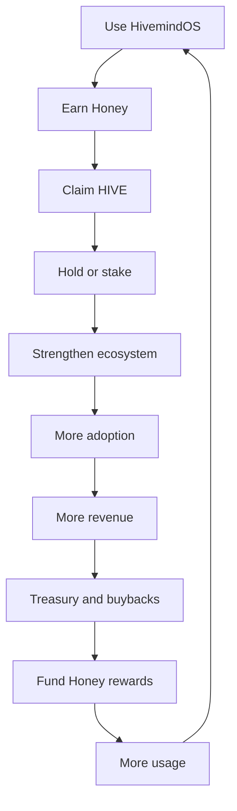

# HivemindOS Ecosystem Plan

HivemindOS stays free and open source. The token should support the ecosystem, not sit in front of the product.

The product comes first.

## Core Principles

Anyone can:

- Self-host HivemindOS.
- Build agents.
- Build swarms.
- Modify the code.
- Run local models.
- Use HivemindOS without owning HIVE.

The token is not required for the core product.

## Premium Services

Revenue comes from optional services that cost real money to operate, maintain, or support.

### Hive Cloud

Managed HivemindOS hosting:

- One-click deployment.
- Managed infrastructure.
- Hosted memory.
- Team workspaces.
- Monitoring.

### Managed Compute

Run agents and swarms on Hivemind infrastructure.

Users pay only for usage.

### Agent Marketplace

Buy and sell:

- Agents.
- Swarms.
- Workflows.
- Templates.

Hivemind can take a marketplace fee.

### Enterprise

Business customers can pay for:

- SSO.
- Teams.
- Compliance.
- Private deployments.
- Support contracts.

## Contribution And Ownership

Honey is the contribution layer. HIVE is the ownership layer.

Honey measures productive participation in the Hivemind ecosystem. HIVE represents ecosystem ownership and alignment.

```text
Use HivemindOS
  -> Earn Honey
  -> Claim HIVE
```

For the deeper token, treasury, buyback, and staking model, see [Honey, HIVE, And Treasury](honey-hive-treasury.html).

## Revenue Allocation

Initial allocation:

| Area               | Share |
| ------------------ | ----: |
| Company operations |   50% |
| Growth             |   20% |
| Treasury           |   15% |
| Buybacks           |   15% |

Company operations includes founder salary, development, hosting, infrastructure, contractors, legal, and accounting.

Growth includes marketing, partnerships, community, and user acquisition.

Treasury builds long-term ecosystem reserves.

Buybacks are used to acquire HIVE from the open market.

## Value Wheel



## One-Sentence Pitch

HivemindOS is a free and open-source operating system for AI agents. Users earn Honey by participating in the ecosystem through usage, creation, contribution, and growth. Honey can be claimed for HIVE, while revenue from optional premium services funds operations, ecosystem growth, treasury reserves, and HIVE buybacks, creating a sustainable flywheel between product adoption and token value.
