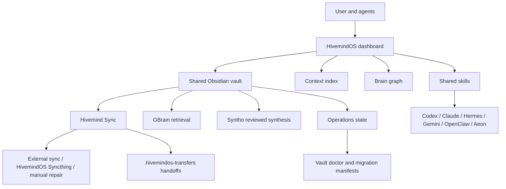

# Whole Brain

The HivemindOS whole brain is the shared memory, retrieval, skill, and coordination system for the fleet.

It is not one magic database. The real anchor is a normal Obsidian markdown vault. Everything else either reads it, writes to it, indexes it, repairs it, or helps agents use it without making a mess.

<section class="atlasHero">
  <strong>Short version:</strong>
  <p>The vault is the durable shared brain. Brain services can index, compile, visualize, or repair it. They do not replace it.</p>
</section>

## Component Pages

<div class="docGrid">
  <section class="docCard">
    <h3>Vault Map</h3>
    <p>The canonical folders, what belongs where, and which paths are operational state.</p>
    <a href="vault-map.html">Open vault map</a>
  </section>
  <section class="docCard">
    <h3>Brain Services</h3>
    <p>GBrain, Syntho, Trading Brain, the Brain Graph, the context index, and service notes.</p>
    <a href="brain-services.html">Open services</a>
  </section>
  <section class="docCard">
    <h3>Shared Skills</h3>
    <p>The shared skill shelf, provider mirrors, auto sync policy, and test cleanup rules.</p>
    <a href="shared-skills.html">Open shared skills</a>
  </section>
  <section class="docCard">
    <h3>Shared Env</h3>
    <p>Where agent secrets live, how hive env helpers work, and why plaintext keys stay out of the vault.</p>
    <a href="shared-env.html">Open shared env</a>
  </section>
  <section class="docCard">
    <h3>Sync And Health</h3>
    <p>Hivemind Sync, vault doctor, conflict cleanup, secure backups, and migration manifests.</p>
    <a href="sync-and-health.html">Open sync docs</a>
  </section>
  <section class="docCard">
    <h3>Architecture Sync</h3>
    <p>The rule that keeps setup, vault structure, agent instructions, tests, and docs aligned.</p>
    <a href="architecture-sync.html">Open sync rules</a>
  </section>
  <section class="docCard">
    <h3>Code Map</h3>
    <p>The source files and API route families that own brain behavior.</p>
    <a href="code-map.html">Open code map</a>
  </section>
</div>

## Mental Model



## Source Of Truth

The durable source of truth is the configured vault, usually:

```text
~/Documents/Obsidian/hivemindos-vault
```

Fresh installs seed this structure through the setup scripts and foundation seeder. Existing installs can run:

```bash
pnpm vault:doctor
pnpm vault:doctor -- --fix
```

The doctor is read only unless `--fix` is passed. Fixes move content into canonical folders or archive stale artifacts under `Operations/Vault Migrations/`.

## Read Next

- [Vault Map](vault-map.html)
- [Brain Services](brain-services.html)
- [Shared Env](shared-env.html)
- [Sync And Health](sync-and-health.html)
- [Architecture Sync](architecture-sync.html)
